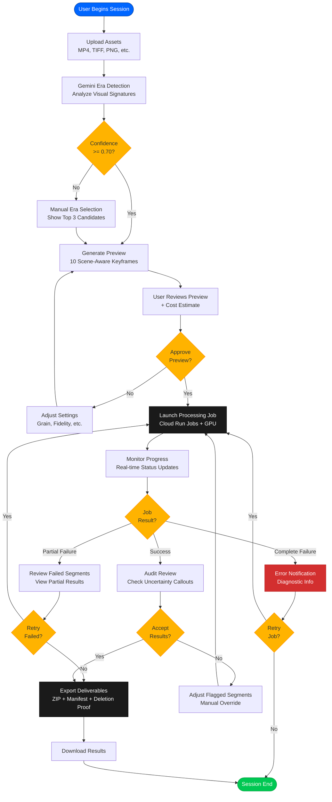
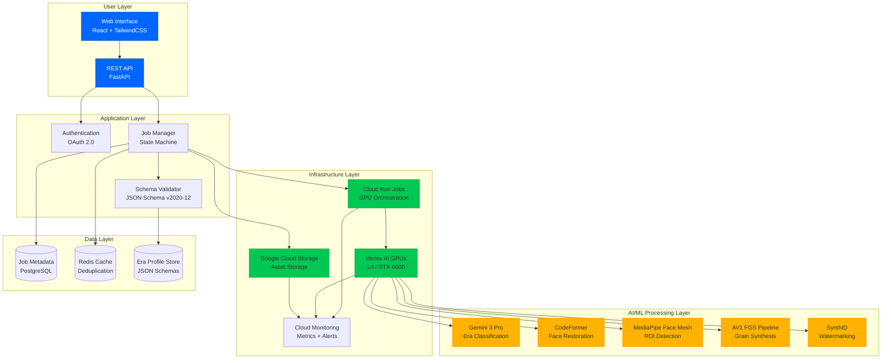
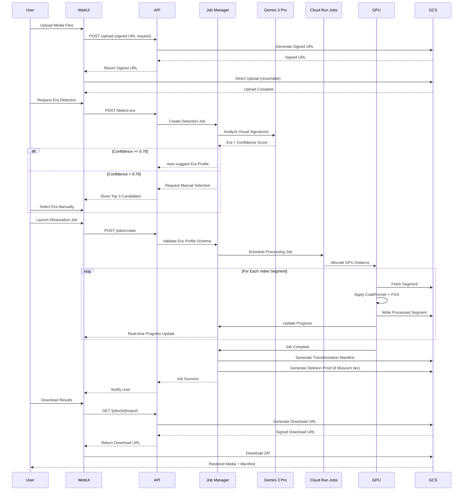

# Product Requirements Document (PRD)

## ChronosRefine v9.0 (Handoff Candidate)

**Positioning Statement:** ChronosRefine is the first media restoration system optimized for **historical authenticity** rather than hyperreal enhancement, utilizing "Anti-Plastic" AI to preserve the unique visual DNA of analog eras.

**Version:** 9.0 (Handoff Candidate - Feb 2026)

**Context Status:** Context only. For current phase sequencing, requirement placement, merged-state status, and kickoff packets, defer to the canonical documents under `docs/specs/` in the order defined by `AGENTS.md`. The roadmap in Section 10 is historical planning context and may intentionally differ from the canonical Coverage Matrix and Implementation Plan.

**Lead Dev Tool:** Codex 5.3 (Interaction Mode: Steering & SDD Enforcement)

**Infrastructure:** GCP (Cloud Run Jobs + Vertex AI L4/RTX 6000 GPUs)

---

## 1. Product Spine & Strategy

### 1.1 Problem Statement

Mass-market AI restoration tools, such as Remini and Topaz Labs, aggressively optimize for hyper-sharpness and noise reduction, often resulting in an undesirable aesthetic known as "AI Slop." This process creates a waxy, artificial look that erases the historical "soul" and texture of the original medium. Users complain that these tools make faces look plastic and destroy the very qualities that give analog media its character [1].

ChronosRefine addresses this problem by prioritizing historical authenticity over hyperrealism. It leverages a sophisticated pipeline combining **AV1 Film Grain Synthesis (FGS)** and **Gemini 3 Pro**-level visual reasoning to automate restoration while preserving the intended data density and texture of the original format. For example, it can restore the 20MP equivalent detail of Kodachrome film or the distinct grain of 16mm stock, ensuring that the restored media remains true to its era [2].

### 1.2 User Personas & Jobs-to-Be-Done (JTBD)

To guide product decisions, we have defined three primary user personas, each with a distinct Job-to-Be-Done.

| Persona | Role | Primary JTBD | Default Tier |
|---|---|---|---|
| **Institutional Archivist** | Digital Preservation Specialist | "Restore archival holdings to publication-grade quality while maintaining a verifiable provenance audit trail that satisfies our institutional review board." | **Conserve** |
| **Documentary Filmmaker** | Post-Production Editor | "Restore decades-old footage to broadcast spec without losing the era-specific texture that tells the story." | **Restore** |
| **Family Historian** | Prosumer Hobbyist | "Make my grandparents' home movies look their best for a reunion without losing the feeling of real memories." | **Enhance** |

### 1.3 Tradeoff Resolution Framework

When feature development presents conflicts between persona needs, this framework provides a clear decision-making matrix. The default tier for each persona determines whose needs are prioritized.

| Conflict Scenario | Conserve (Archivist) | Restore (Filmmaker) | Enhance (Prosumer) |
|---|---|---|---|
| **Speed vs. Audit Depth** | Archivist wins: Full, auditable manifest is required. | Filmmaker wins: Manifest is optional for faster processing. | Prosumer wins: Fastest path with no manifest required. |
| **Grain Intensity Default** | Preserve all original grain. | "Matched" preset that is era-accurate. | "Subtle" preset with reduced grain for a cleaner look. |
| **Preview Complexity** | Show all uncertainty callouts and technical details. | Show 10 representative keyframes. | Show 3 keyframes and a simple fidelity slider. |
| **Error UX Detail** | Full technical error codes for detailed diagnostics. | Summarized error with a one-click retry option. | Plain language explanation with an automatic retry. |


## 2. End-to-End User Journey & Error Catalog

This section outlines the complete user workflow from asset ingestion to final export, along with a comprehensive catalog of potential error states and their corresponding recovery paths.

### 2.1 User Journey

The user journey is designed to be intuitive for prosumers while offering the depth required by institutional professionals.

1.  **Ingest**: Users perform a batch upload of assets (MP4, TIFF, PNG, etc.) via a secure web interface. The system supports resumable uploads of 10GB+ per file, leveraging Google Cloud Storage (GCS) for robust, scalable intake.
2.  **Detection**: Gemini 3 Pro (or a subsequent, more advanced model) analyzes the visual signatures of each asset to automatically suggest an **Era Profile** (e.g., "1960s Kodachrome Film," "1980s VHS Tape"). This includes identifying key forensic markers like film grain structure, color saturation patterns, and format-specific artifacts like VHS tracking noise [3].
3.  **Preview**: The system generates 10 scene-aware keyframes for user review, allowing for a quick assessment of the suggested restoration. The acceptance criteria for this step is a p95 generation time of less than 6 seconds.
4.  **Launch**: After reviewing the preview and the estimated processing cost, the user launches the full restoration job, which is executed as a series of parallel tasks on GCP Cloud Run Jobs.
5.  **Audit Review**: Upon completion, users can review the results, including any "Uncertainty Callouts." These callouts flag areas where the AI had low confidence, such as historical ambiguity in colorized uniforms or potential identity shifts in facial restoration. This feature is critical for the Institutional Archivist persona.
6.  **Export**: Users can download the final deliverables, which include a ZIP file containing the restored media, a detailed **Transformation Manifest** (a JSON file documenting every step of the restoration), and a cryptographically signed **Deletion Proof** for compliance workflows.

### 2.2 Error State Catalog

To ensure a robust and user-friendly experience, ChronosRefine defines clear behaviors and recovery paths for a wide range of error scenarios.

| Error Scenario | Trigger Condition | System Behavior | User-Facing UX & Recovery Path |
|---|---|---|---|
| **Low-Confidence Era** | Gemini confidence score < 0.70 | Block auto-processing; surface the top 3 most likely candidate eras with their confidence scores. | A modal appears stating, "We're not confident about this media's era. Please confirm or select from our best guesses." The user selects the correct era manually to proceed. |
| **Chunk Processing Failure (Transient)** | A transient node failure occurs during a processing segment. | The system's idempotency key detects the incomplete segment and automatically retries the operation on a new node (maximum of 3 retries). | The user sees a temporary pause in the progress bar, which then shows "Reprocessing segment..." before continuing. The recovery is automatic. |
| **Chunk Processing Failure (Persistent)** | The same processing segment fails 3 consecutive times. | The system marks the segment as failed, completes all other segments, and packages the partial results. | A notification appears: "One segment failed to process. You can download the partial result now or retry the failed segment." The user can choose to download the successful portions or re-queue only the failed segment. |
| **E_HF Violation (Texture Loss)** | The Texture Energy (E_HF) metric falls below the target threshold for a specific frame range. | The system flags the affected frames and automatically applies a fallback to a lower-intensity restoration for that segment to preserve texture. | An "Uncertainty Callout" is generated: "Frames X-Y may appear softer to preserve original texture." The user can accept the change or manually adjust the Fidelity Slider for that segment. |
| **Hallucination Limit Exceeded** | The hallucination_limit (ratio of generated content) exceeds the 0.05 threshold in "Conserve" mode. | The job is paused, and the problematic segment is flagged for manual review. | A notification alerts the user: "A segment exceeded the authenticity threshold for Conserve mode and requires manual review." The user is guided to the specific segment to approve or reject the restoration. |
| **Upload Interruption** | A network failure interrupts a large file upload (>10GB). | The GCS resumable upload protocol preserves all completed chunks. | A banner appears: "Upload interrupted. [Resume] to continue from where you left off." Clicking "Resume" continues the upload from the last confirmed byte. |

### 2.3 Visual System Diagrams

To provide clarity on the user journey, system architecture, and data flow, the following diagrams illustrate the key workflows and technical components of ChronosRefine.

#### User Journey Flowchart

This flowchart maps the complete user journey from asset upload to final export, including all decision points, error handling paths, and recovery mechanisms.



**Key Decision Points:**
- **Era Confidence Gate**: If Gemini confidence < 0.70, manual selection is required
- **Preview Approval**: Users can iterate on settings before launching the full job
- **Job Result Handling**: Graceful degradation for partial failures with retry options
- **Audit Review**: Uncertainty callouts allow manual override before export

#### System Architecture Diagram

This diagram illustrates the layered architecture of ChronosRefine, showing the separation of concerns between the user layer, application logic, AI/ML processing, infrastructure, and data persistence.



**Architecture Highlights:**
- **User Layer**: React-based web interface with REST API backend
- **Application Layer**: Job orchestration with schema validation and authentication
- **AI/ML Layer**: Five specialized models (Gemini, CodeFormer, MediaPipe, FGS, SynthID)
- **Infrastructure Layer**: Cloud Run Jobs for GPU orchestration with monitoring
- **Data Layer**: PostgreSQL for job metadata, Redis for deduplication cache

#### Data Flow Sequence Diagram

This sequence diagram traces the complete data flow from upload through processing to final export, showing the interactions between all system components.



**Data Flow Stages:**
1. **Upload**: Resumable uploads via signed GCS URLs
2. **Detection**: Gemini analyzes visual signatures for era classification
3. **Processing**: Cloud Run Jobs orchestrate GPU-based restoration
4. **Export**: Manifest generation and signed download URLs

## 3. Technical Contract: Era Profile Schema

To prevent subjective, "vibes-based" drift and ensure reproducible, high-fidelity restorations, every job executed by ChronosRefine must validate against a strict **Era Profile Schema**. This schema defines the forensic characteristics, artifact policies, and resolution caps for each supported historical media type.

### 3.1 JSON Schema v2020-12 (Validation Rules)

The following rules are enforced by the processing pipeline before any job is executed. These rules are critical for maintaining the integrity of the different restoration tiers.

-   **Rule A**: If `capture_medium` is `vhs`, then the `artifact_policy.deinterlace` property MUST be `true`.
-   **Rule B**: If `mode` is `Conserve`, then the `hallucination_limit` property MUST be less than or equal to `0.05`.
-   **Rule C**: If the `gemini_confidence` score for era detection is less than `0.70`, the system MUST force a manual user confirmation step before proceeding.

#### Complete JSON Schema Specification

The following JSON Schema v2020-12 specification is the authoritative contract that all processing jobs must validate against before execution. This schema is implementation-ready and should be used directly in the validation layer.

```json
{
  "$schema": "https://json-schema.org/draft/2020-12/schema",
  "$id": "https://chronosrefine.com/schemas/era-profile.json",
  "title": "Era Profile Schema",
  "description": "Defines the forensic characteristics, artifact policies, and resolution caps for historical media restoration",
  "type": "object",
  "required": ["capture_medium", "mode", "era_range", "artifact_policy", "resolution_cap"],
  "properties": {
    "capture_medium": {
      "type": "string",
      "enum": ["daguerreotype", "albumen", "16mm", "super_8", "kodachrome", "vhs"],
      "description": "The historical media format being restored"
    },
    "mode": {
      "type": "string",
      "enum": ["Conserve", "Restore", "Enhance"],
      "description": "Restoration intensity tier"
    },
    "era_range": {
      "type": "object",
      "required": ["start_year", "end_year"],
      "properties": {
        "start_year": {"type": "integer", "minimum": 1839, "maximum": 2000},
        "end_year": {"type": "integer", "minimum": 1839, "maximum": 2000}
      }
    },
    "hallucination_limit": {
      "type": "number",
      "minimum": 0,
      "maximum": 0.35,
      "description": "Maximum ratio of AI-generated content allowed (0.0-0.35)"
    },
    "gemini_confidence": {
      "type": "number",
      "minimum": 0,
      "maximum": 1,
      "description": "Confidence score from Gemini era classification (0.0-1.0)"
    },
    "resolution_cap": {
      "type": "string",
      "enum": ["native_scan", "4k", "2k", "1080p", "720p"],
      "description": "Maximum output resolution for this media type"
    },
    "artifact_policy": {
      "type": "object",
      "required": ["grain_intensity"],
      "properties": {
        "deinterlace": {
          "type": "boolean",
          "description": "Whether to apply deinterlacing (required for VHS)"
        },
        "grain_intensity": {
          "type": "string",
          "enum": ["Matched", "Subtle", "Heavy"],
          "description": "Film grain synthesis intensity preset"
        },
        "preserve_edge_fog": {
          "type": "boolean",
          "default": true,
          "description": "Preserve edge fogging artifacts (film formats)"
        },
        "preserve_chromatic_aberration": {
          "type": "boolean",
          "default": true,
          "description": "Preserve lens chromatic aberration"
        }
      }
    },
    "quality_targets": {
      "type": "object",
      "properties": {
        "e_hf_min": {
          "type": "number",
          "minimum": 0,
          "maximum": 1,
          "description": "Minimum texture retention ratio (high-frequency energy)"
        },
        "s_ls_min": {
          "type": "number",
          "minimum": 0,
          "maximum": 1,
          "description": "Minimum light stability score"
        },
        "lpips_identity_max": {
          "type": "number",
          "minimum": 0,
          "maximum": 0.1,
          "description": "Maximum LPIPS identity drift for facial regions"
        }
      }
    }
  },
  "allOf": [
    {
      "if": {
        "properties": {"capture_medium": {"const": "vhs"}}
      },
      "then": {
        "properties": {
          "artifact_policy": {
            "required": ["deinterlace"],
            "properties": {"deinterlace": {"const": true}}
          }
        }
      }
    },
    {
      "if": {
        "properties": {"mode": {"const": "Conserve"}}
      },
      "then": {
        "properties": {
          "hallucination_limit": {"maximum": 0.05}
        },
        "required": ["hallucination_limit"]
      }
    },
    {
      "if": {
        "properties": {"gemini_confidence": {"maximum": 0.70}}
      },
      "then": {
        "properties": {
          "manual_confirmation_required": {"const": true}
        },
        "required": ["manual_confirmation_required"]
      }
    }
  ]
}
```

#### Canonical Enum Definitions and Defaults

To prevent ambiguity and ensure consistent implementation, the following canonical enum lists define all allowed values with their semantic meanings and default values.

| Property | Enum Values | Default | Semantic Meaning |
|---|---|---|---|
| **capture_medium** | `daguerreotype`, `albumen`, `16mm`, `super_8`, `kodachrome`, `vhs` | N/A (user-selected or Gemini-detected) | Historical media format being restored |
| **mode** | `Conserve`, `Restore`, `Enhance` | `Restore` | Restoration intensity tier (maps to fidelity tier) |
| **resolution_cap** | `native_scan`, `4k`, `2k`, `1080p`, `720p` | Tier-dependent (see table below) | Maximum output resolution |
| **grain_intensity** | `Matched`, `Subtle`, `Heavy` | `Matched` | Film grain synthesis intensity preset |

**Resolution Cap Defaults by Tier:**

| Tier | Default Resolution Cap | Rationale |
|---|---|---|
| Hobbyist (Free) | `1080p` | Balances quality with compute costs |
| Pro | `4k` | Professional standard for modern displays |
| Museum | `native_scan` | Preserves maximum archival fidelity |

#### Formal Validation Rules Structure

Beyond the JSON Schema conditional logic, the following validation rules define the complete set of constraints that must be enforced by the processing pipeline. Each rule includes severity level and user-facing error messages.

**Validation Rule Format:**

```json
{
  "rule_id": "string",
  "if": "condition expression",
  "then": "constraint expression",
  "severity": "error | warning | info",
  "message": "User-facing error message"
}
```

**Complete Validation Rules (10 Exemplar Rules):**

| Rule ID | If (Condition) | Then (Constraint) | Severity | Message |
|---|---|---|---|---|
| **VR-001** | `capture_medium == "vhs"` | `artifact_policy.deinterlace == true` | error | "VHS media requires deinterlacing. Set artifact_policy.deinterlace to true." |
| **VR-002** | `mode == "Conserve"` | `hallucination_limit <= 0.05` | error | "Conserve mode limits AI-generated content to 5%. Current: {hallucination_limit}." |
| **VR-003** | `gemini_confidence < 0.70` | `manual_confirmation_required == true` | error | "Era detection confidence is low ({gemini_confidence}). Manual confirmation required." |
| **VR-004** | `mode == "Conserve"` | `artifact_policy.grain_intensity == "Matched"` | error | "Conserve mode requires grain_intensity='Matched' to preserve authenticity." |
| **VR-005** | `mode == "Enhance"` | `hallucination_limit >= 0.15` | warning | "Enhance mode typically uses hallucination_limit >= 0.15 for best results." |
| **VR-006** | `capture_medium in ["daguerreotype", "albumen"]` | `resolution_cap in ["2k", "4k", "native_scan"]` | error | "Early photography formats require minimum 2K resolution to preserve detail." |
| **VR-007** | `tier == "Museum"` AND `mode == "Conserve"` | `artifact_policy.preserve_edge_fog == true` AND `artifact_policy.preserve_chromatic_aberration == true` | error | "Museum Conserve tier requires all artifact preservation flags set to true." |
| **VR-008** | `era_range.start_year > era_range.end_year` | N/A (schema validation) | error | "Era start_year ({start_year}) cannot be later than end_year ({end_year})." |
| **VR-009** | `mode == "Restore"` | `0.05 < hallucination_limit <= 0.20` | warning | "Restore mode typically uses hallucination_limit between 0.05 and 0.20." |
| **VR-010** | `tier == "Hobbyist"` AND `resolution_cap != "1080p"` | N/A (tier enforcement) | error | "Hobbyist tier is limited to 1080p resolution. Upgrade to Pro for 4K." |

#### Locked vs Tunable Parameter Rules by Tier/Mode

To prevent "we followed the schema but changed the spirit" drift, the following table defines which parameters are **locked** (system-enforced, non-negotiable) vs **tunable** (user-adjustable within constraints) for each tier and mode combination.

**Parameter Tunability Matrix:**

| Parameter | Hobbyist + Enhance | Pro + Conserve | Pro + Restore | Pro + Enhance | Museum + Conserve | Museum + Restore | Museum + Enhance |
|---|---|---|---|---|---|---|---|
| **capture_medium** | 🔓 Tunable | 🔓 Tunable | 🔓 Tunable | 🔓 Tunable | 🔓 Tunable | 🔓 Tunable | 🔓 Tunable |
| **mode** | 🔒 Locked (`Enhance`) | 🔓 Tunable | 🔓 Tunable | 🔓 Tunable | 🔓 Tunable | 🔓 Tunable | 🔓 Tunable |
| **hallucination_limit** | 🔒 Locked (0.25) | 🔒 Locked (≤0.05) | 🔓 Tunable (0.05-0.20) | 🔓 Tunable (0.15-0.35) | 🔒 Locked (≤0.05) | 🔓 Tunable (0.05-0.20) | 🔓 Tunable (0.15-0.35) |
| **resolution_cap** | 🔒 Locked (1080p) | 🔒 Locked (4K max) | 🔒 Locked (4K max) | 🔒 Locked (4K max) | 🔓 Tunable (up to native_scan) | 🔓 Tunable (up to native_scan) | 🔓 Tunable (up to native_scan) |
| **grain_intensity** | 🔓 Tunable | 🔒 Locked (`Matched`) | 🔓 Tunable | 🔓 Tunable | 🔒 Locked (`Matched`) | 🔓 Tunable | 🔓 Tunable |
| **preserve_edge_fog** | 🔒 Locked (false) | 🔒 Locked (true) | 🔓 Tunable | 🔓 Tunable | 🔒 Locked (true) | 🔓 Tunable | 🔓 Tunable |
| **preserve_chromatic_aberration** | 🔒 Locked (false) | 🔒 Locked (true) | 🔓 Tunable | 🔓 Tunable | 🔒 Locked (true) | 🔓 Tunable | 🔓 Tunable |

**Legend:**
- 🔒 **Locked**: System-enforced value; user cannot modify (enforced by tier/mode contract)
- 🔓 **Tunable**: User can adjust within defined constraints (shown in parentheses)

**Enforcement Mechanism:**

The validation layer must enforce these rules in the following order:

1. **Tier-based access control**: Block access to modes/features not included in user's tier
2. **Schema validation**: Validate against JSON Schema v2020-12 specification
3. **Validation rules**: Apply all VR-001 through VR-010 rules with severity enforcement
4. **Locked parameter enforcement**: Override any user-provided values for locked parameters with tier/mode defaults
5. **Tunable parameter bounds checking**: Ensure tunable parameters fall within allowed ranges

### 3.2 Forensic Benchmark Table

This table documents the specific visual artifacts and characteristics that the system is designed to preserve for each media type, along with the maximum supported resolution cap for restoration. This table has been expanded to include all supported media types as recommended in the PRD review.

| Era | Medium | Forensics to Preserve | Resolution Cap |
|---|---|---|---|
| 1839–1860 | Daguerreotype | Mirror-surface depth; mercury-drop texture. | Native Scan |
| 1850–1900 | Albumen | Yellowed highlights; fading at edges; albumen sheen on paper substrate; foxing patterns. | Native Scan (6-12MP equivalent) |
| 1923–1980 | 16mm Film | Fine grain structure; optical printing artifacts; edge fog; sprocket registration variation; higher contrast than 35mm. | 2K (2048x1556) |
| 1935–1970 | Kodachrome | Non-substantive red saturation; 20MP equivalent density. | 4K (Ultra HD) |
| 1965–1980 | Super 8mm | "Chunky" soft grain; gate weave/jitter. | 1080p |
| 1975–2000 | VHS | Chroma noise; interlacing artifacts; tracking lines. | 720p |

## 4. Quality Measurement Spec (Reproducible)

To ensure that ChronosRefine consistently delivers on its promise of historical authenticity, we have defined a set of reproducible quality metrics. These metrics are designed to be objective, measurable, and directly tied to the core product value of preventing "AI Slop."

### 4.1 Anti-Plastic Metrics

These metrics are designed to quantify and prevent the artificial, "waxy" look that plagues many AI restoration tools. To ensure reproducibility across implementations and prevent gaming, the following specifications define exact measurement protocols.

#### E_HF (Texture Retention)

This metric measures the ratio of high-frequency power (calculated via a Fourier transform) in the skin region of a MediaPipe Face Mesh between the restored and source images. A higher E_HF score indicates better preservation of fine skin texture.

**Formula:**

E_HF = ∫f_high |Restored(f)|²df / ∫f_high |Source(f)|²df

where f_high represents the top 30% of spatial frequencies.

**Explicit Frequency Band Definition (Resolution-Normalized):**

To ensure consistent E_HF measurement across different resolutions, the high-frequency band is defined as a function of the Nyquist frequency (maximum representable frequency for a given resolution).

**Frequency Band Calculation:**

1. **Nyquist Frequency**: f_nyquist = min(width, height) / 2 (in cycles per image dimension)
2. **High-Frequency Cutoff**: f_high_cutoff = 0.70 × f_nyquist (top 30% of frequencies)
3. **High-Frequency Band**: f_high ∈ [f_high_cutoff, f_nyquist]

**Resolution-Specific Examples:**

| Resolution | Width × Height | Nyquist Frequency | High-Frequency Cutoff (70% of Nyquist) | High-Frequency Band |
|---|---|---|---|---|
| **1080p** | 1920 × 1080 | 540 cycles/image | 378 cycles/image | [378, 540] cycles/image |
| **4K** | 3840 × 2160 | 1080 cycles/image | 756 cycles/image | [756, 1080] cycles/image |
| **Native Scan (8K)** | 7680 × 4320 | 2160 cycles/image | 1512 cycles/image | [1512, 2160] cycles/image |
| **720p** | 1280 × 720 | 360 cycles/image | 252 cycles/image | [252, 360] cycles/image |

**Implementation Notes:**

- Use 2D FFT (Fast Fourier Transform) to compute frequency spectrum
- Apply Hamming window to ROI before FFT to reduce spectral leakage
- Compute power spectral density (PSD) in frequency domain: PSD(f) = |FFT(ROI)|²
- Integrate PSD over high-frequency band: ∫f_high PSD(f) df
- Normalize by total power to make metric scale-invariant: E_HF = Power_high / Power_total

**Pseudocode:**

```python
import numpy as np
from scipy.fft import fft2, fftshift
from scipy.signal import hamming

def compute_e_hf(roi_restored, roi_source):
    # Apply Hamming window
    window = np.outer(hamming(roi_restored.shape[0]), hamming(roi_restored.shape[1]))
    roi_restored_windowed = roi_restored * window
    roi_source_windowed = roi_source * window
    
    # Compute 2D FFT
    fft_restored = fftshift(fft2(roi_restored_windowed))
    fft_source = fftshift(fft2(roi_source_windowed))
    
    # Compute power spectral density
    psd_restored = np.abs(fft_restored) ** 2
    psd_source = np.abs(fft_source) ** 2
    
    # Define high-frequency band (top 30% of frequencies)
    nyquist = min(roi_restored.shape) / 2
    f_high_cutoff = 0.70 * nyquist
    
    # Create frequency mask
    freq_x = np.fft.fftfreq(roi_restored.shape[1], d=1.0)
    freq_y = np.fft.fftfreq(roi_restored.shape[0], d=1.0)
    freq_magnitude = np.sqrt(freq_x[None, :]**2 + freq_y[:, None]**2)
    high_freq_mask = (freq_magnitude >= f_high_cutoff) & (freq_magnitude <= nyquist)
    
    # Integrate power over high-frequency band
    power_high_restored = np.sum(psd_restored[high_freq_mask])
    power_high_source = np.sum(psd_source[high_freq_mask])
    
    # Compute E_HF ratio
    e_hf = power_high_restored / power_high_source
    
    return e_hf
```

**ROI (Region of Interest) Details:**

To ensure consistent measurement across implementations, the following face regions are included or excluded from E_HF calculation:

| Face Region | Included in E_HF? | Rationale |
|---|---|---|
| **Forehead** | ✅ Yes | High-texture area; critical for detecting plastic smoothing |
| **Cheeks** | ✅ Yes | Primary skin texture region; most visible in portraits |
| **Nose bridge** | ✅ Yes | Contains fine pore detail |
| **Eyes (sclera, iris, pupil)** | ❌ No | Non-skin regions; different texture characteristics |
| **Lips** | ❌ No | Different texture from skin; can bias metric |
| **Eyebrows** | ❌ No | Hair texture; not representative of skin |
| **Ears** | ✅ Yes (if visible) | Skin texture region |

**No-Face Fallback:**

When MediaPipe Face Mesh fails to detect a face (e.g., landscape shots, extreme damage), the system falls back to the following protocol:

1. **Attempt Scene Classification**: Use Gemini to classify the scene type (portrait, landscape, document, mixed)
2. **Apply Scene-Specific ROI**:
   - **Portrait (no face detected)**: Use center 50% of frame as ROI
   - **Landscape**: Use center 25% of frame (assumes subject matter in center)
   - **Document**: Use entire frame (uniform texture distribution)
   - **Mixed**: Use center 50% of frame
3. **Flag for Manual Review**: If E_HF score deviates >20% from era baseline, flag as "Uncertain" for manual review

**Noise-Floor Handling:**

To prevent "keeping noise" from scoring as "keeping texture," the following noise-floor correction is applied:

1. **Measure Source Noise**: Calculate noise power in flat regions (sky, uniform backgrounds) using wavelet denoising
2. **Noise Threshold**: If source noise power > 0.15 (on 0-1 scale), apply noise-floor correction
3. **Correction Formula**: E_HF_corrected = (E_HF_raw - noise_floor) / (1 - noise_floor)
4. **Validation**: Noise-floor correction must not artificially inflate E_HF by >10%

**Target Thresholds:**

| Mode | E_HF Target | Interpretation |
|---|---|---|
| **Conserve** | ≥0.85 | Preserve 85%+ of source texture |
| **Restore** | ≥0.70 | Preserve 70%+ of source texture |
| **Enhance** | ≥0.60 | Acceptable texture loss for quality gain |

#### S_LS (Light Stability)

This metric measures the temporal brightness dynamics to ensure that the restoration process does not introduce unnatural flickering or light shifts.

**Formula:**

S_LS = 1 - (σ(ΔL) / μ(L))

where:
- ΔL = frame-to-frame luminance difference (excluding scene cuts)
- σ(ΔL) = standard deviation of luminance differences
- μ(L) = mean luminance across all frames

**Scene-Cut Detection Masking:**

To avoid false positives from intentional scene transitions, the following masking protocol is applied:

1. **Scene-Cut Detection**: Use histogram difference method (threshold: >0.30 change in luminance histogram)
2. **Masking Window**: Exclude first and last **3 frames** of any detected scene transition from S_LS calculation
3. **Minimum Scene Length**: Scenes <10 frames are excluded entirely (likely transition artifacts)

**Frame Sampling Rules:**

To ensure consistent S_LS measurement across implementations, the following sampling protocol is mandatory:

| Video Duration | Sampling Frequency | Minimum Samples | Rationale |
|---|---|---|---|
| <1 minute | Every frame | All frames | Short clips require dense sampling |
| 1-10 minutes | 1 frame per second | 60 frames minimum | Balances coverage and compute |
| 10-60 minutes | 1 frame per 2 seconds | 300 frames minimum | Adequate for temporal stability |
| >60 minutes | 1 frame per 5 seconds | 720 frames minimum | Long-form content sampling |

**Scene-Aware Sampling Override:**

If scene-cut detection identifies >20 scenes, apply the following override:

- Sample **N frames per scene** where N = max(3, total_target_samples / scene_count)
- Distribute samples evenly within each scene (avoid clustering near scene cuts)

**Target Threshold:**

S_LS ≥ 0.45 for all modes (Conserve, Restore, Enhance)

#### T_TC (Texture Temporal Consistency) - NEW

To detect fine-texture flicker that may be stable in luminance but unstable in high-frequency detail, we introduce a new temporal metric.

**Definition:**

T_TC measures the frame-to-frame consistency of high-frequency texture energy in the same spatial regions, independent of luminance changes.

**Formula:**

T_TC = 1 - (σ(ΔE_HF) / μ(E_HF))

where:
- ΔE_HF = frame-to-frame change in E_HF score for the same ROI
- σ(ΔE_HF) = standard deviation of E_HF changes
- μ(E_HF) = mean E_HF score across all frames

**Measurement Protocol:**

1. **Track ROI Across Frames**: Use optical flow to track the same facial ROI across consecutive frames
2. **Calculate E_HF Per Frame**: Compute E_HF for the tracked ROI in each frame
3. **Measure Temporal Variance**: Calculate frame-to-frame E_HF changes
4. **Apply Scene-Cut Masking**: Use same masking protocol as S_LS (exclude 3 frames before/after cuts)

**Target Threshold:**

| Mode | T_TC Target | Interpretation |
|---|---|---|
| **Conserve** | ≥0.90 | Minimal texture flicker |
| **Restore** | ≥0.85 | Low texture flicker |
| **Enhance** | ≥0.80 | Acceptable texture flicker |

**Failure Protocol:**

If T_TC < threshold for any mode, generate an **Uncertainty Callout** flagging the affected frame range for manual review.

#### Anti-Plastic Metrics Summary Table

| Metric | Measures | Target (Conserve) | Target (Restore) | Target (Enhance) | Sampling Protocol |
|---|---|---|---|---|---|
| **E_HF** | Texture retention in facial ROI | ≥0.85 | ≥0.70 | ≥0.60 | Per-frame with noise-floor correction |
| **S_LS** | Temporal luminance stability | ≥0.45 | ≥0.45 | ≥0.45 | Scene-aware sampling (see table) |
| **T_TC** | Texture temporal consistency | ≥0.90 | ≥0.85 | ≥0.80 | Optical flow tracking with scene-cut masking |

### 4.2 Success Metrics & Key Performance Indicators (KPIs)

We will track a combination of leading and lagging indicators to monitor product health during beta and post-launch.

#### Leading Indicators (Tracked During Beta)

These metrics provide an early warning system for potential issues before a general audience release.

| Metric | Target | Measurement Method | Alert Threshold |
|---|---|---|---|
| **Era Classification Accuracy** | >90% | Automated test against the 2,000-item Heritage Test Set. | <85% triggers model retraining. |
| **Preview Abandonment Rate** | <15% | Percentage of users who generate preview keyframes but cancel the job. | >25% triggers a UX investigation. |
| **Uncertainty Callout Density** | <3 per job (avg) | Average number of callouts generated per job across all media types. | >5 avg suggests model confidence issues. |
| **GPU Pre-warm p99** | <120s | Cloud Monitoring on the GPU pool's readiness latency. | >120s triggers autoscaler tuning. |

#### Lagging Indicators (Tracked Post-GA)

These metrics validate product-market fit and overall user satisfaction after launch.

| Metric | Target | Measurement Method | Review Cadence |
|---|---|---|---|
| **Human Preference Score (HPS)** | ≥75% | Quarterly evaluator panel using the formal HPS protocol. | Quarterly |
| **Net Promoter Score (NPS)** | >40 | In-app survey presented to users upon successful export completion. | Monthly |
| **Export Completion Rate** | >85% | Percentage of started jobs that result in a successful download. | Weekly |
| **Museum Tier Adoption** | >5% of paid users | Tracking the distribution of users across the different pricing tiers. | Monthly |

### 4.3 Human Preference Score (HPS) Protocol

The Human Preference Score is the ultimate gate for General Availability (GA). It measures whether human evaluators perceive the output as a successful restoration. The protocol is designed to be rigorous and unbiased.

| Parameter | Specification |
|---|---|
| **Full Name** | Human Preference Score (HPS) |
| **Definition** | The percentage of evaluator judgments where the ChronosRefine output is preferred over the unrestored source, measured via a forced-choice A/B comparison. |
| **Evaluator Pool** | A minimum of 20 evaluators per media category, composed of a mix of domain experts (archivists, colorists) and target prosumer users. |
| **Sample Size** | 100 items per media category (Daguerreotype, Albumen, 16mm, Super 8, Kodachrome, VHS), stratified by damage severity. |
| **Protocol** | Double-blind study where evaluators are shown the source and restored media side-by-side in a randomized position. They are asked, "Which better represents the original subject while appearing undamaged?" |
| **GA Gate** | **HPS ≥ 75% in EACH media category individually.** An average score across categories is not sufficient. |
| **Failure Protocol** | Any category scoring below 75% will block the GA of that category. Other categories that meet the HPS gate may proceed independently. |

### 4.4 Dataset Governance & Rights

This section establishes the governance framework for all datasets used in ChronosRefine development, testing, and evaluation. Proper dataset governance is critical for legal defensibility, institutional customer confidence, and ensuring that quality metrics (HPS, E_HF, S_LS, T_TC) are measured against representative, ethically sourced data.

#### Heritage Test Set: Provenance & Composition

The **Heritage Test Set** is the authoritative dataset used for HPS evaluation, anti-plastic metric validation, and era classification accuracy measurement. It consists of 2,000 historical media items with documented provenance and stratified coverage.

**Provenance Sources:**

| Source Category | Percentage | Specific Sources | Rights Status |
|---|---|---|---|
| **Public Domain Archives** | 60% | Library of Congress (Prints & Photographs Division), Internet Archive (Moving Image Archive), Smithsonian Open Access | Public Domain (CC0 or equivalent) |
| **Licensed Historical Collections** | 25% | Getty Images Historical Collection, Bridgeman Images, National Archives (NARA) | Licensed for evaluation and training use; not for marketing/demos |
| **Synthetic/Simulated Degradation** | 10% | High-quality modern captures with algorithmically applied era-accurate degradation (grain, scratches, color shift) | Original content licensed; synthetic degradation is proprietary |
| **User-Contributed (Consent-Based)** | 5% | Beta user submissions with explicit consent for evaluation use | User consent agreement includes evaluation rights; not for training |

**Stratification Dimensions:**

To ensure the Heritage Test Set is representative and prevents bias, the following stratification is enforced:

| Dimension | Distribution | Rationale |
|---|---|---|
| **Era/Medium** | 333 items per category (Daguerreotype, Albumen, 16mm, Super 8, Kodachrome, VHS) | Ensures equal representation across all supported media types |
| **Damage Severity** | 33% light, 33% moderate, 33% severe | Validates performance across full range of restoration difficulty |
| **Content Type** | 40% portraits, 30% landscapes, 20% documents, 10% mixed | Reflects typical use case distribution |
| **Skin Tone Diversity** | Monk Skin Tone Scale representation: 10-15% per MST category (1-10) | Prevents ethnic/racial bias in facial restoration (Identity Lock validation) |
| **Lighting Conditions** | 25% low-light, 50% normal, 25% high-contrast | Ensures S_LS metric is validated across lighting extremes |
| **Geographic Diversity** | 40% North America, 30% Europe, 20% Asia, 10% Other | Prevents Western-centric bias in era classification and restoration |

#### Licensing & Permitted Uses

All datasets used in ChronosRefine are governed by strict licensing agreements that define permitted uses. The following table clarifies allowed and prohibited uses:

| Dataset | Training (Model Fine-Tuning) | Evaluation (HPS, Metrics) | Demos/Marketing | Public Distribution |
|---|---|---|---|---|
| **Heritage Test Set** | ❌ Prohibited | ✅ Allowed | ⚠️ Allowed (Public Domain only) | ❌ Prohibited |
| **Training Dataset (CodeFormer)** | ✅ Allowed | ❌ Prohibited (to prevent overfitting) | ❌ Prohibited | ❌ Prohibited |
| **Synthetic Degradation Set** | ✅ Allowed | ✅ Allowed | ✅ Allowed | ❌ Prohibited |
| **User-Contributed (Consent)** | ❌ Prohibited | ✅ Allowed | ❌ Prohibited | ❌ Prohibited |

**License Compliance Enforcement:**

- All dataset access is logged via Cloud Audit Logs with user ID, timestamp, and purpose (training/evaluation/demo)
- Quarterly license compliance audits conducted by Legal team
- Any dataset use outside permitted scope triggers automatic alert to Legal and Product teams
- Violation of licensing terms results in immediate dataset access revocation and incident review

#### PII Policy: Faces, Minors, and Consent

Historical media often contains identifiable individuals, including minors. The following policies govern the handling of Personally Identifiable Information (PII) in datasets:

**Face Detection & Consent:**

1. **Automatic Face Detection**: All dataset items undergo MediaPipe Face Mesh detection to identify faces
2. **Public Domain Exception**: Faces in Public Domain materials (pre-1928 or explicitly CC0) are exempt from consent requirements
3. **Licensed Collections**: Licensed datasets (Getty, Bridgeman, NARA) include model release or historical exemption status in metadata
4. **User-Contributed**: Requires explicit consent form acknowledging:
   - Face detection and use for evaluation purposes
   - No redistribution or public display without separate permission
   - Right to request removal at any time (honored within 30 days)

**Minor Protection Policy:**

| Scenario | Policy | Enforcement |
|---|---|---|
| **Minors in Public Domain** | Allowed (historical exemption) | Metadata flagged as "historical_minor" for audit purposes |
| **Minors in Licensed Collections** | Allowed only if model release or historical exemption documented | Legal review required before inclusion |
| **Minors in User-Contributed** | Prohibited unless parental/guardian consent obtained | Automatic rejection during dataset ingestion |
| **Minors in Marketing/Demos** | Prohibited in all cases | Automated filter blocks any item flagged as containing minors |

**Redaction Capabilities:**

For institutional customers with strict PII requirements, ChronosRefine provides:

- **Face Redaction Mode**: Automatically blurs or pixelates detected faces in Transformation Manifests and preview keyframes
- **Metadata Scrubbing**: Removes EXIF location data, camera serial numbers, and timestamps from exported files
- **Audit Log Redaction**: Museum Tier customers can enable PII redaction in audit logs (retains job ID and processing parameters only)

#### Retention & Access Control

**Dataset Storage & Retention:**

| Dataset | Storage Location | Retention Period | Access Control |
|---|---|---|---|
| **Heritage Test Set** | GCS bucket (us-central1, multi-region replication) | Indefinite (archival) | Engineering team + Data Science team (IAM-controlled) |
| **Training Dataset** | GCS bucket (us-central1, single-region) | 2 years post-model retirement | Data Science team only (IAM-controlled) |
| **User-Contributed** | GCS bucket (us-central1, multi-region) | Per user consent (default: 1 year) | Data Science team + Legal (for consent verification) |
| **Synthetic Degradation** | GCS bucket (us-central1, single-region) | Indefinite (proprietary) | Engineering team + Data Science team |

**Access Logging & Auditing:**

- All dataset access logged via Cloud Audit Logs with:
  - User ID (service account or human)
  - Timestamp (UTC)
  - Purpose (training/evaluation/demo/audit)
  - Items accessed (file paths or dataset IDs)
- Quarterly access audits conducted by Security team
- Anomalous access patterns (e.g., bulk downloads, off-hours access) trigger automatic alerts
- Annual dataset governance review by Legal, Security, and Product teams

#### Bias Coverage & Representation

To ensure ChronosRefine performs equitably across diverse user populations and content types, the Heritage Test Set enforces the following bias coverage requirements:

**Demographic Representation (Portraits Only):**

| Dimension | Target Distribution | Measurement Method | Failure Protocol |
|---|---|---|---|
| **Skin Tone (Monk Scale)** | 10-15% per MST category (1-10) | Manual annotation by diverse evaluator panel | Any category <5% triggers dataset rebalancing |
| **Gender Presentation** | 45-55% male, 45-55% female, 5-10% non-binary/ambiguous | Manual annotation by evaluator panel | Any category <40% triggers dataset rebalancing |
| **Age Range** | 20% children, 30% young adults, 30% middle-aged, 20% elderly | Estimated age from visual analysis | Any category <15% triggers dataset rebalancing |
| **Facial Hair** | 30% clean-shaven, 40% stubble/light beard, 30% full beard/mustache | Automated detection + manual verification | Informational only (no rebalancing) |

**Technical Diversity (All Content Types):**

| Dimension | Target Distribution | Rationale |
|---|---|---|
| **Damage Types** | 25% scratches, 25% water damage, 25% fading/discoloration, 25% mixed | Ensures E_HF and S_LS metrics validated across all damage modes |
| **Grain Levels** | 33% fine grain (Kodachrome), 33% medium grain (16mm), 33% heavy grain (VHS) | Validates AV1 FGS parameter derivation across grain extremes |
| **Color Spaces** | 40% color, 30% B&W, 20% sepia, 10% hand-tinted | Prevents color-centric bias in era classification |
| **Aspect Ratios** | 30% 4:3, 30% 16:9, 20% 1:1 (square), 20% other (panoramic, portrait) | Ensures ROI selection works across all aspect ratios |

**Bias Monitoring & Remediation:**

- **Quarterly Bias Audits**: HPS and anti-plastic metrics disaggregated by skin tone, gender, age, damage type
- **Disparate Impact Threshold**: If any subgroup performs >10% worse than overall average, triggers investigation
- **Remediation Protocol**:
  1. Root cause analysis (dataset imbalance vs model bias vs metric design)
  2. Dataset rebalancing if underrepresented (<5% of target)
  3. Model retraining if bias is model-induced
  4. Metric refinement if bias is measurement artifact
- **Public Transparency**: Annual bias audit report published for Museum Tier customers

#### Dataset Versioning & Change Control

To ensure reproducibility and auditability, all datasets are versioned and changes are tracked:

**Versioning Scheme:**

- **Format**: `heritage-test-set-vYYYY.MM` (e.g., `heritage-test-set-v2026.02`)
- **Trigger for New Version**:
  - Addition/removal of >5% of items
  - Change in stratification criteria
  - License status change for any item
  - Bias remediation requiring rebalancing
- **Backward Compatibility**: All HPS and metric results tagged with dataset version used

**Change Control Process:**

1. **Proposal**: Data Science team proposes dataset change with justification
2. **Review**: Legal (licensing), Security (PII), Product (bias coverage) review
3. **Approval**: Requires sign-off from all three teams
4. **Implementation**: New dataset version created with changelog
5. **Validation**: HPS and metrics re-run on new version; results compared to previous version
6. **Rollout**: New version becomes default for all future evaluations

**Changelog Example:**

```
heritage-test-set-v2026.02 (Released: Feb 15, 2026)
- Added 50 items: Increased VHS representation from 300 to 350 items
- Removed 20 items: License expiration for Getty Images subset
- Rebalanced: Increased MST 8-10 representation from 8% to 12%
- License update: 15 items moved from "Licensed" to "Public Domain" (copyright expiration)
```

#### Compliance with Institutional Requirements

Many institutional customers (museums, archives, universities) have specific dataset governance requirements. ChronosRefine provides the following capabilities to meet these needs:

**Institutional Dataset Isolation:**

- Museum Tier customers can request **private Heritage Test Set** using only their own archival materials
- Private test sets stored in customer-specific GCS buckets with customer-managed encryption keys (CMEK)
- HPS and metrics calculated on private test set for customer-specific validation
- Results not commingled with public Heritage Test Set results

**Data Processing Agreements (DPA):**

- Standard DPA template available for Museum Tier customers
- Covers dataset provenance, licensing, PII handling, retention, and deletion
- Customizable to meet specific institutional policies (e.g., FERPA for universities, HIPAA for medical archives)

**Right to Audit:**

- Museum Tier customers can request annual dataset governance audit
- Audit includes: license compliance, PII handling, access logs, bias coverage
- Audit report provided within 30 days of request

## 5. Phased Requirements Traceability Matrix (RTM)

This expanded Requirements Traceability Matrix ensures that every feature, user journey step, risk mitigation, and operational commitment is mapped to a specific, testable requirement. This is critical for managing scope, ensuring test coverage, and verifying handoff readiness.

| ID | Requirement (REQ) | DOD (Auditable Artifacts) | Acceptance Criteria (AC) |
|---|---|---|---|
| REQ-101 | **Resumable Uploads**: System must support signed URL-based resumable uploads for files >10GB. | Terraform IAM policy check; signed build artifacts from GCS. | Signed URLs are generated in <1s; upload resumes successfully for files >10GB after network interruption. |
| REQ-102 | **Era Classification**: Gemini 3 Pro must classify media era with confidence scoring. | Automated test logs from Heritage Test Set evaluation. | Era classification accuracy >90%; confidence score <0.70 correctly triggers the manual user confirmation workflow. |
| REQ-103 | **Uncertainty Callout UX**: The UI must surface "Uncertainty Callouts" for low-confidence AI judgments. | UI audit showing flags for `hallucination_limit` > 0.20. | Callouts are surfaced for 100% of jobs in "Enhance" mode that exceed the hallucination threshold; callouts are dismissible per-item. |
| REQ-104 | **SynthID Watermarking**: System must apply SynthID imperceptible watermarking to all outputs. | Bitstream verification tool; fallback manifest metadata. | SynthID watermark survives re-encoding in AV1/MP4 containers; manifest metadata fallback is verified for all non-supported formats. |
| REQ-105 | **Deduplication**: System must reuse cached segment outputs for identical reruns within a 1-hour window. | SRE monitoring dashboard showing cache hit rate. | Duplicate detection latency is <500ms; cached segment reuse reduces GPU cost by >40% for identical jobs. |
| REQ-106 | **Preview Generation**: System must generate 10 scene-aware keyframes for user review before full processing. | UI audit showing preview modal with keyframes; performance logs showing generation time. | 10 keyframes generated using scene detection algorithm; p95 generation time <6 seconds; keyframes are representative of full video (distributed across scenes, not just first 10 frames). |
| REQ-107 | **Fidelity Configuration UX**: System must allow users to select Fidelity Tier and override era classification with confidence score warning. | UI audit showing Fidelity Tier selector and era override modal; user interaction logs. | Three Fidelity Tiers (Enhance, Restore, Conserve) selectable via dropdown; era override available when confidence <0.70; override triggers warning modal: "AI confidence is X%. Confirm override to [selected era]?"; user selection persists for job execution. |
| REQ-201B | **Identity Lock**: "Conserve" mode must lock facial reconstruction to prevent identity drift. | LPIPS metric reports from test set runs. | Reconstruction weight is clamped to <0.05; LPIPS identity drift from source is <0.02 on facial Regions of Interest (ROI). |
| REQ-303 | **Auditable Deletion**: Museum Tier must support 0-day deletion with auditable proof. | Cloud Audit Log `ObjectDelete` event verified. | A signed Deletion Proof is generated and exportable as a PDF within 10 seconds of a deletion request. |
| REQ-304 | **Grain Intensity Presets**: System must provide "Matched/Subtle/Heavy" grain intensity presets. | UI audit showing preset options in the interface. | Three presets are available for each Era Profile; "Matched" is the default; user can override the setting on a per-job basis. |
| REQ-401 | **GPU Pool Pre-warming**: The system must pre-warm a GPU pool to meet processing time SLOs. | Cloud Monitoring dashboard showing pool readiness. | Cold-start to ready latency is <120s for the 99th percentile; the autoscaler maintains a minimum warm pool of N instances. |
| REQ-402 | **AV1 FGS Injection**: The system must inject AV1 Film Grain Synthesis parameters based on the Era Profile. | Bitstream analysis of output files. | FGS parameters are correctly derived from the Era Profile; resulting grain energy is within 10% of the source measurement on the test set. |
| REQ-501 | **Cost Estimate Before Launch**: System must display cost estimate before user launches processing job. | UI audit showing cost estimate modal; API logs confirming estimate calculation. | Cost estimate is shown in preview modal with breakdown (GPU time, storage, total); estimate updates when user changes settings (resolution, mode, etc.). |
| REQ-502 | **Hard Stop at Monthly Limit**: System must enforce hard stop when user reaches included monthly minutes unless overage is explicitly approved. | Job queue logs showing blocked jobs; user notification screenshots. | Jobs are blocked when monthly limit reached; user sees modal: "You've used X/Y minutes. Approve overage at $Z/min to continue?"; job proceeds only after explicit approval. |
| REQ-503 | **Overage Billing Transparency**: System must display overage rate, rounding rules, and running total during job execution. | UI audit showing overage banner; billing logs with per-minute charges. | Overage rate ($0.50/min for Pro, $0.40/min for Museum) displayed prominently; minutes rounded up to nearest minute; running total updated in real-time during job execution. |
| REQ-504 | **Estimate Accuracy Target**: Cost estimates must be within 10-15% of actual costs for jobs >10 minutes. | Billing reconciliation report comparing estimates vs actuals. | 90% of jobs have estimate error <15%; 95% of jobs have estimate error <20%; outliers flagged for investigation and estimate model refinement. |

## 6. Operations & SRE

This section defines the operational standards, Service Level Objectives (SLOs), and Site Reliability Engineering (SRE) practices that ensure ChronosRefine is a robust, reliable, and scalable service.

-   **Idempotency Key**: To ensure that retried processing segments produce deterministically equivalent results, every operation uses a unique idempotency key. This key is a hash of the `job_id`, `segment_index`, `model_digest`, and `era_profile`.

### 6.1 Reproducibility Proof: Deterministic vs Bit-Identical

ChronosRefine provides **deterministic reproducibility** with **perceptual equivalence** guarantees, rather than strict bit-identical output. This design acknowledges the practical realities of video processing pipelines where encoder versions, GPU drivers, metadata ordering, and floating-point precision can introduce non-deterministic variations that do not affect perceptual quality.

#### Reproducibility Contract

Given identical inputs and pinned environment versions, ChronosRefine guarantees:

1. **Deterministic Inputs**: Same source file, same Era Profile, same processing parameters
2. **Pinned Environment**: Container digest, model digest, encoder build version locked
3. **Frame-Equivalence Tolerance**: Decoded frames are perceptually identical within epsilon (defined below)
4. **Anti-Plastic Metric Stability**: E_HF, S_LS, T_TC metrics remain within tight deltas (defined below)

**What is NOT guaranteed:**

- **Bit-identical output files**: Encoder metadata, timestamps, or minor floating-point variations may differ
- **Identical file sizes**: Compression artifacts may vary by <1% due to encoder non-determinism
- **Identical processing times**: GPU scheduling and network latency introduce timing variations

#### Reproducibility Modes

ChronosRefine supports three reproducibility modes to balance strictness with practicality:

| Mode | Guarantee | Use Case | Availability |
|---|---|---|---|
| **Perceptual Equivalence** (Default) | Decoded frames visually identical; metrics within epsilon | Standard production use | All tiers |
| **Deterministic** | Frame hashes identical; metrics exact match | Compliance/audit workflows | Pro + Museum tiers |
| **Bit-Identical** | Output files byte-for-byte identical | Legal/forensic workflows | Museum tier only (requires fully pinned environment) |

#### Perceptual Equivalence Mode (Default)

**Frame-Equivalence Tolerance:**

Two output files are considered perceptually equivalent if:

1. **Decoded Frame Hash**: SHA-256 hash of decoded YUV frames matches within **epsilon = 0.001%** (allows for minor floating-point rounding)
2. **Anti-Plastic Metrics**: E_HF, S_LS, T_TC metrics differ by **<0.5%** from baseline
3. **Visual Inspection**: Random sample of 10 frames passes pixel-wise comparison with **PSNR >50 dB**

**Measurement Protocol:**

```bash
# Decode both outputs to raw YUV frames
ffmpeg -i output_v1.mp4 -f rawvideo -pix_fmt yuv420p output_v1.yuv
ffmpeg -i output_v2.mp4 -f rawvideo -pix_fmt yuv420p output_v2.yuv

# Compute frame hashes
sha256sum output_v1.yuv > hash_v1.txt
sha256sum output_v2.yuv > hash_v2.txt

# Compare hashes (allow 0.001% difference)
python compare_hashes.py hash_v1.txt hash_v2.txt --epsilon 0.001

# Verify anti-plastic metrics
python verify_metrics.py output_v1.mp4 output_v2.mp4 --tolerance 0.005
```

**Failure Handling:**

If perceptual equivalence check fails:

1. **Auto-Rerun**: System automatically retries the job once before failing
2. **Segment Isolation**: If only specific segments fail, system isolates and re-processes those segments
3. **Escalation**: After 2 failed attempts, job is flagged for manual review with detailed diff report

#### Deterministic Mode (Pro + Museum Tiers)

**Stricter Guarantees:**

1. **Frame Hashes Exact Match**: SHA-256 hash of decoded YUV frames must be byte-for-byte identical
2. **Metrics Exact Match**: E_HF, S_LS, T_TC metrics must match to **6 decimal places**
3. **Metadata Normalization**: Encoder metadata (timestamps, creation dates) is normalized before comparison

**Environment Pinning Requirements:**

To enable Deterministic mode, the following environment components must be pinned:

| Component | Pinning Method | Example |
|---|---|---|
| **Container Image** | Docker digest (SHA-256) | `gcr.io/chronosrefine/processor@sha256:abc123...` |
| **CodeFormer Model** | Git commit hash | `v0.1.0-abc123` |
| **Gemini Model** | API version + model snapshot | `gemini-3.0-pro-vision-20260201` |
| **AV1 Encoder** | libaom version + build flags | `libaom-3.8.2-deterministic` |
| **GPU Driver** | CUDA version + driver version | `CUDA 12.3, Driver 535.129.03` |

**Activation:**

```json
{
  "reproducibility_mode": "deterministic",
  "environment_pinning": {
    "container_digest": "sha256:abc123...",
    "model_versions": {
      "codeformer": "v0.1.0-abc123",
      "gemini": "gemini-3.0-pro-vision-20260201"
    },
    "encoder": "libaom-3.8.2-deterministic"
  }
}
```

#### Bit-Identical Mode (Museum Tier Only)

**Strictest Guarantee:**

Output files are **byte-for-byte identical** including all metadata, timestamps, and compression artifacts.

**Requirements:**

1. **Fully Pinned Environment**: All components from Deterministic mode PLUS:
   - Fixed random seed for any stochastic operations
   - Disabled encoder optimizations that introduce non-determinism
   - Controlled GPU scheduling (single-threaded processing)
2. **Performance Trade-off**: Processing time increases by **2-3x** due to disabled optimizations
3. **Cost Impact**: GPU costs increase proportionally to processing time

**Use Cases:**

- Legal/forensic workflows requiring chain-of-custody proof
- Compliance workflows where byte-identical reproducibility is mandated
- Research workflows requiring exact replication

**Activation:**

Requires explicit opt-in via Museum Tier settings:

```json
{
  "reproducibility_mode": "bit_identical",
  "performance_acknowledgment": "I understand this will increase processing time by 2-3x",
  "environment_pinning": {
    "container_digest": "sha256:abc123...",
    "model_versions": {...},
    "encoder": "libaom-3.8.2-deterministic",
    "random_seed": 42,
    "gpu_scheduling": "single_threaded"
  }
}
```

#### Reproducibility Proof Generation

For all modes, ChronosRefine generates a **Reproducibility Proof** that can be used to verify that two outputs are equivalent:

**Proof Contents:**

```json
{
  "reproducibility_proof": {
    "mode": "deterministic",
    "job_id": "job_abc123",
    "idempotency_key": "hash(job_id + segment_index + model_digest + era_profile)",
    "environment": {
      "container_digest": "sha256:abc123...",
      "model_versions": {...},
      "encoder": "libaom-3.8.2-deterministic"
    },
    "verification": {
      "frame_hash": "sha256:def456...",
      "metrics": {
        "e_hf": 0.823456,
        "s_ls": 0.567890,
        "t_tc": 0.901234
      },
      "timestamp": "2026-02-15T10:30:00Z",
      "verified_by": "chronosrefine-verifier-v1.0"
    }
  }
}
```

**Verification Process:**

1. User provides original Reproducibility Proof from first run
2. System re-runs job with identical inputs and environment
3. System compares new output against proof using mode-specific criteria
4. System generates **Verification Report** with pass/fail status and detailed diff

**Verification Report Example:**

```
Reproducibility Verification Report
====================================
Mode: Deterministic
Original Job ID: job_abc123
Verification Job ID: job_xyz789
Status: PASS

Frame Hash Comparison:
  Original: sha256:def456...
  Verified: sha256:def456...
  Match: ✅ Exact match

Metrics Comparison:
  E_HF: 0.823456 vs 0.823456 (delta: 0.000000) ✅
  S_LS: 0.567890 vs 0.567890 (delta: 0.000000) ✅
  T_TC: 0.901234 vs 0.901234 (delta: 0.000000) ✅

Conclusion: Outputs are deterministically equivalent.
```

#### Segment-Level to Job-Level Rollup

ChronosRefine processes videos in segments (typically 10-second chunks). Reproducibility is verified at both segment and job levels:

**Segment-Level Verification:**

- Each segment is independently verifiable using its own idempotency key
- Segment verification uses same mode-specific criteria as job-level
- Failed segments are flagged individually in Verification Report

**Job-Level Rollup Rules:**

| Segment Failure Rate | Job-Level Status | Action |
|---|---|---|
| **0% (all pass)** | PASS | Job is fully reproducible |
| **<5% (1-2 segments)** | PARTIAL_PASS | Job is mostly reproducible; failed segments flagged for review |
| **5-20% (3-10 segments)** | FAIL | Job is not reproducible; auto-rerun triggered |
| **>20% (>10 segments)** | CRITICAL_FAIL | Job is severely non-reproducible; escalated to engineering |

**Auto-Rerun Protocol:**

If job-level status is FAIL:

1. **Immediate**: System automatically retries failed segments (max 2 retries per segment)
2. **After 2 retries**: If still failing, system isolates failed segments and completes successful ones
3. **User Notification**: User receives notification with partial results and option to:
   - Download partial results (successful segments only)
   - Re-queue failed segments with manual environment override
   - Request engineering investigation (Museum Tier only)

-   **Service Level Objectives (SLOs)**:
    -   **Job Success Rate**: 99.5% of all submitted jobs must complete successfully.
    -   **GPU Pool Pre-warm Time**: The p99 latency for a new GPU instance to become ready must be less than 120 seconds.
    -   **Processing Time**: The p95 processing time for a job must be less than 2x the duration of the source video.
    -   **Reproducibility Success Rate**: 95% of jobs in Perceptual Equivalence mode pass verification on first attempt; 99% pass after auto-rerun.

-   **Deduplication**: The system will reuse cached segment outputs for identical reruns (based on the idempotency key) that occur within a 1-hour window. This significantly reduces cost and improves turnaround time for users who may be iterating on settings. Deduplication is compatible with all reproducibility modes.

## 7. Security & Compliance

Security and compliance are foundational to ChronosRefine, particularly when handling sensitive archival materials for institutional clients. This section outlines our commitment to data protection, regulatory adherence, and secure access control.

### 7.1 Data Classification and Handling

A strict data classification policy is enforced to protect user content at all stages.

| Data Type | Classification | Encryption at Rest | Encryption in Transit | Retention Default | Museum Tier Options |
|---|---|---|---|---|---|
| Source Uploads | Confidential | AES-256 (GCS default) | TLS 1.3 | Per-tier (7d / 90d / configurable) | CMEK available |
| Processed Outputs | Confidential | AES-256 | TLS 1.3 | Same as source | CMEK available |
| Transformation Manifests | Internal | AES-256 | TLS 1.3 | Tier-configurable (see below) | Manifest redaction mode available |
| Deletion Proofs | Compliance | AES-256 | TLS 1.3 | Retained 7 years minimum | Configurable retention (1-10 years) |

### 7.2 Compliance Frameworks

ChronosRefine is **designed to support** stringent regulatory and institutional requirements. The following compliance posture reflects our current implementation status and roadmap.

-   **GDPR (General Data Protection Regulation)**: The service is **designed to support GDPR compliance obligations**, particularly Article 17 (Right to Erasure), which is facilitated via the signed Deletion Proof feature. A Data Processing Agreement (DPA) will be available for all Museum Tier customers. **Note**: Final GDPR compliance certification requires legal review and is pending as of this PRD version.
-   **SOC 2 Type II**: We are targeting SOC 2 Type II **audit readiness** for the Museum Tier by GA+6 months. Our use of Cloud Audit Logs and strict access control policies are designed to meet these audit requirements. **Status**: Pre-audit controls implementation in progress; formal audit scheduled for GA+3 months.
-   **Cultural Sensitivity**: Recognizing the importance of handling culturally significant materials with respect, the system includes a "sensitive material" flag. Processing of indigenous materials, human remains imagery, or sacred objects will trigger an additional consent workflow flag for institutional review.

### 7.3 Transformation Manifest Retention Policy

Transformation Manifests contain processing metadata that enables reproducibility but may also contain sensitive information (file paths, user IDs, processing timestamps). To balance reproducibility with institutional deletion requirements, the following tier-configurable retention policies are available:

| Tier | Default Retention | Configurable Options | Manifest Redaction Mode |
|---|---|---|---|
| **Hobbyist** | 7 days (same as source) | Not configurable | Not available |
| **Pro** | 90 days (same as source) | Not configurable | Not available |
| **Museum** | Indefinite | 0 days, 90 days, 1 year, 5 years, indefinite | **Available** (redacts user PII, retains processing parameters) |

**Manifest Redaction Mode:**

When enabled, the system generates two versions of the Transformation Manifest:

1. **Full Manifest**: Contains all metadata including user IDs, file paths, timestamps (retained per policy)
2. **Redacted Manifest**: Contains only processing parameters (era profile, model versions, quality metrics) with all PII removed (retained indefinitely)

This allows institutions to maintain reproducibility while complying with data retention limits.

**Configuration:**

Museum Tier customers can configure retention policy via:
- Web UI: Settings > Data Retention > Transformation Manifests
- API: `PATCH /settings/retention` with `{"manifest_retention_days": 0, "manifest_redaction_enabled": true}`

### 7.4 Access Control

-   **IAM**: The Principle of Least Privilege is enforced via Terraform-managed IAM policies. Quarterly IAM audits will be conducted to ensure ongoing compliance.
-   **API Authentication**: Museum Tier API access is secured via OAuth 2.0 and API keys, with rate limiting set at 500 requests per minute.
-   **Multi-tenancy**: Strict project-level isolation is enforced in GCS, ensuring that there is no possibility of cross-tenant data access at the infrastructure level.

### 7.5 Enterprise-Grade Security Controls (Museum Tier)

The following advanced security controls are available exclusively for Museum Tier customers to meet institutional security and compliance requirements.

#### Customer-Managed Encryption Keys (CMEK)

**Availability**: Museum Tier only  
**Status**: Planned for GA+3 months

**Description**: Customers can provide their own encryption keys managed via Google Cloud KMS or AWS KMS. All source uploads, processed outputs, and manifests are encrypted with customer-provided keys.

**Benefits**:
- Customer retains full control over encryption keys
- Ability to revoke access to data by destroying keys
- Meets institutional requirements for key custody

**Configuration**:
- Web UI: Settings > Security > Encryption Keys > "Use Customer-Managed Keys"
- API: `POST /settings/cmek` with `{"kms_key_uri": "projects/PROJECT/locations/LOCATION/keyRings/RING/cryptoKeys/KEY"}`

**Limitations**:
- Adds 50-100ms latency to upload/download operations
- Customer responsible for key lifecycle management and availability
- Key rotation requires re-encryption of existing data

#### VPC Service Controls & Private Networking

**Availability**: Museum Tier only (on request)  
**Status**: Planned for GA+6 months

**Description**: For customers with strict network isolation requirements, ChronosRefine can be deployed within a VPC Service Perimeter with private networking.

**Deployment Options**:

| Option | Description | Use Case | Availability |
|---|---|---|---|
| **Public Endpoints** | Standard deployment with public HTTPS endpoints | Most customers | GA |
| **VPC Service Controls** | API endpoints restricted to customer's VPC perimeter | Customers with strict data exfiltration controls | GA+6 months |
| **Private Service Connect** | Fully private connectivity via PSC endpoint | Maximum isolation for highly sensitive materials | GA+9 months (on request) |

**Requirements**:
- Customer must have GCP VPC Service Controls configured
- Additional setup fee: $5,000 one-time
- Minimum contract: 12 months

**Configuration**:
- Contact dedicated account manager for private networking setup
- Requires architecture review and custom deployment plan

#### Log Retention & PII Redaction Policy

**Availability**: All tiers (with tier-specific capabilities)  
**Status**: GA

**Overview:**

ChronosRefine generates extensive logs for monitoring, debugging, and compliance purposes. However, these logs may inadvertently contain Personally Identifiable Information (PII) or sensitive content metadata. This section defines log retention policies and PII redaction mechanisms to balance operational needs with privacy requirements.

**Log Categories & Retention:**

| Log Category | Content | Retention (Hobbyist) | Retention (Pro) | Retention (Museum) | PII Risk |
|---|---|---|---|---|---|
| **Application Logs** | API requests, job status, error messages | 7 days | 30 days | Configurable (7d-1yr) | Medium (user IDs, file names) |
| **Audit Logs** | User actions, data access, config changes | 30 days | 90 days | Configurable (90d-7yr) | High (user IDs, IP addresses, file paths) |
| **Processing Logs** | GPU metrics, model inference times, segment status | 7 days | 30 days | Configurable (7d-90d) | Low (job IDs, processing parameters) |
| **Error Traces** | Stack traces, exception details, debug info | 14 days | 60 days | Configurable (14d-180d) | High (file paths, user input, API keys if leaked) |
| **Billing Logs** | Usage metrics, overage charges, tier changes | 1 year | 2 years | Configurable (2yr-7yr) | Medium (user IDs, payment metadata) |

**PII Redaction Modes:**

ChronosRefine provides three PII redaction modes to meet different institutional requirements:

| Mode | Description | Availability | Performance Impact |
|---|---|---|---|
| **None** (Default) | No PII redaction; full logs retained | All tiers | None |
| **Standard Redaction** | Automatic redaction of common PII patterns (emails, IPs, file paths with usernames) | Pro + Museum | <5% latency increase |
| **Strict Redaction** | Aggressive redaction including user IDs, job IDs, all file paths, timestamps (retains only processing parameters) | Museum only | 10-15% latency increase |

**Standard Redaction Patterns:**

When Standard Redaction is enabled, the following patterns are automatically redacted from logs:

| PII Type | Pattern | Redacted Replacement | Example |
|---|---|---|---|
| **Email Addresses** | Regex: `\b[A-Za-z0-9._%+-]+@[A-Za-z0-9.-]+\.[A-Z|a-z]{2,}\b` | `[EMAIL_REDACTED]` | `user@example.com` → `[EMAIL_REDACTED]` |
| **IP Addresses** | Regex: `\b(?:[0-9]{1,3}\.){3}[0-9]{1,3}\b` | `[IP_REDACTED]` | `192.168.1.1` → `[IP_REDACTED]` |
| **File Paths (with usernames)** | Regex: `/home/([^/]+)/.*` or `/users/([^/]+)/.*` | `/home/[USER_REDACTED]/...` | `/home/jsmith/video.mp4` → `/home/[USER_REDACTED]/video.mp4` |
| **User IDs** | Regex: `user_id["':=]\s*["']?([a-zA-Z0-9_-]+)` | `user_id=[USER_ID_REDACTED]` | `user_id=abc123` → `user_id=[USER_ID_REDACTED]` |
| **API Keys (leaked)** | Regex: `(api[_-]?key|token)["':=]\s*["']?([a-zA-Z0-9_-]{20,})` | `api_key=[API_KEY_REDACTED]` | `api_key=sk_live_abc123...` → `api_key=[API_KEY_REDACTED]` |

**Strict Redaction Additional Patterns:**

In addition to Standard Redaction, Strict Redaction also redacts:

| PII Type | Pattern | Redacted Replacement |
|---|---|---|
| **Job IDs** | `job_[a-zA-Z0-9_-]+` | `[JOB_ID_REDACTED]` |
| **All File Paths** | Any string matching `/.*` or `C:\\.*` | `[FILE_PATH_REDACTED]` |
| **Timestamps** | ISO 8601 timestamps | `[TIMESTAMP_REDACTED]` (retains date only: `2026-02-15`) |
| **GCS Bucket Paths** | `gs://[bucket-name]/.*` | `gs://[BUCKET_REDACTED]/[PATH_REDACTED]` |

**Configuration:**

Museum Tier customers can configure log retention and PII redaction via:

**Web UI:**
- Settings > Security > Logs & Privacy
- Select retention period for each log category
- Choose PII redaction mode (None, Standard, Strict)

**API:**
```json
PATCH /settings/logs
{
  "retention": {
    "application_logs_days": 90,
    "audit_logs_days": 365,
    "processing_logs_days": 30,
    "error_traces_days": 60,
    "billing_logs_days": 730
  },
  "pii_redaction_mode": "strict"
}
```

**Avoiding Sensitive Content in Logs:**

Beyond automatic PII redaction, ChronosRefine follows these best practices to minimize sensitive content in logs:

1. **No User Content Logging**: Source media frames, restored outputs, and preview keyframes are NEVER logged (only job IDs and processing status)
2. **Sanitized Error Messages**: User-facing error messages do not include file paths, user IDs, or processing parameters (only generic error codes)
3. **Structured Logging**: All logs use structured JSON format with explicit PII fields that can be selectively redacted or excluded
4. **Log Sampling**: High-volume logs (e.g., GPU metrics) are sampled at 1% to reduce storage and PII exposure
5. **Ephemeral Debug Logs**: Debug-level logs are only enabled on-demand for specific jobs and auto-expire after 24 hours

**Audit Log Retention for Compliance:**

For institutional customers subject to compliance requirements (GDPR, SOC 2, HIPAA), audit logs must be retained for specific periods:

| Compliance Framework | Minimum Retention | ChronosRefine Default (Museum Tier) |
|---|---|---|
| **GDPR** | 6 months (for data processing records) | 1 year |
| **SOC 2 Type II** | 1 year (for access logs) | 2 years |
| **HIPAA** | 6 years (for healthcare-related data) | Configurable up to 7 years |
| **FERPA** | 3 years (for educational records) | Configurable up to 7 years |

**Log Export for External SIEM:**

Museum Tier customers can export logs to external Security Information and Event Management (SIEM) systems for long-term retention and analysis:

**Supported Export Formats:**
- Cloud Logging (Google Cloud)
- CloudWatch Logs (AWS)
- Splunk HEC (HTTP Event Collector)
- Syslog (RFC 5424)

**Export Configuration:**
```json
POST /settings/log_export
{
  "enabled": true,
  "destination": "splunk",
  "endpoint": "https://splunk.example.com:8088/services/collector",
  "token": "[SPLUNK_HEC_TOKEN]",
  "log_categories": ["application_logs", "audit_logs"],
  "pii_redaction": "standard"
}
```

**Log Deletion & Right to Erasure:**

Under GDPR Article 17 (Right to Erasure), users can request deletion of their logs:

**Deletion Scope:**
- All logs containing user ID, IP address, or file paths are permanently deleted
- Aggregated/anonymized logs (e.g., "total jobs processed today") are retained for analytics
- Deletion Proof is generated and provided to user within 10 days

**Deletion Process:**
1. User submits deletion request via Web UI or API: `POST /user/delete_logs`
2. System identifies all logs containing user PII across all log categories
3. Logs are permanently deleted from GCS and any backup/archive storage
4. Cloud Audit Log `LogDelete` event is generated for compliance verification
5. Signed Deletion Proof (PDF) is generated and emailed to user

**Deletion Proof Contents:**
- User ID and request timestamp
- List of log categories deleted (with date ranges)
- Total number of log entries deleted
- Cryptographic signature (SHA-256 hash + timestamp)
- Verification instructions for institutional auditors

### 7.6 Data Residency & Internationalization

**Availability:** Museum Tier (data residency); All tiers (i18n roadmap)  
**Status:** Data residency GA; i18n planned for GA+6 months

#### Data Residency Policy

Many institutional customers, particularly those in the European Union, have legal requirements that data never leave specific geographic regions. ChronosRefine provides **region-locking capabilities** to meet these requirements.

**Supported GCS Regions:**

| Region | Location | Primary Use Case | Availability |
|---|---|---|---|
| **us-central1** | Iowa, USA | Default for North American customers | GA (all tiers) |
| **europe-west1** | Belgium, EU | EU customers with GDPR data residency requirements | GA (Museum Tier) |
| **asia-east1** | Taiwan, Asia | Asian customers with regional data requirements | GA+3 months (Museum Tier) |
| **australia-southeast1** | Sydney, Australia | Australian customers with regional requirements | GA+6 months (Museum Tier) |

**Data Residency Guarantee:**

When region-locking is enabled (Museum Tier only), ChronosRefine guarantees that:

1. **Source Uploads:** All uploaded media files are stored in the customer-selected GCS region
2. **Processing:** All GPU processing occurs in the same region (Cloud Run Jobs deployed regionally)
3. **Processed Outputs:** All restored media and Transformation Manifests are stored in the same region
4. **Logs:** All application, audit, and processing logs are stored in the same region
5. **Backups:** All backup/archive storage remains in the same region (no cross-region replication)

**What Crosses Regional Boundaries:**

- **API Calls to Gemini/SynthID:** These Google AI services may process requests in US data centers regardless of customer region
- **Billing Data:** Payment processing via Stripe may involve US data centers
- **Support Communications:** Email/Slack support may route through US servers

**Configuration:**

Museum Tier customers can configure data residency via:

**Web UI:**
- Settings > Data & Privacy > Data Residency
- Select region from dropdown (us-central1, europe-west1, asia-east1, australia-southeast1)
- Acknowledge that region change will not migrate existing data (manual migration required)

**API:**
```json
PATCH /settings/data_residency
{
  "region": "europe-west1",
  "enforce_strict_residency": true,
  "acknowledgment": "I understand that existing data will not be automatically migrated"
}
```

**Strict Residency Mode:**

For customers with the most stringent requirements, **Strict Residency Mode** ensures that even API calls to Gemini/SynthID are routed through EU endpoints (when available):

- **Gemini EU Endpoint:** `gemini-eu.googleapis.com` (available for europe-west1)
- **SynthID EU Endpoint:** `synthid-eu.googleapis.com` (planned for GA+3 months)
- **Fallback:** If EU endpoints unavailable, jobs are queued until endpoints become available (no automatic fallback to US)

**Limitations:**

- Strict Residency Mode may increase processing latency by 10-20% due to regional API routing
- Not all Google AI services have regional endpoints; roadmap tracked in dependency registry
- Region changes do not automatically migrate existing data; manual migration via export/import required

#### Internationalization (i18n)

**Current Status:** English-only UI and metadata (GA)  
**Roadmap:** Multi-language support planned for GA+6 months

**Planned Language Support:**

| Language | UI Translation | Transformation Manifest Metadata | Era Profile Descriptions | Target Release |
|---|---|---|---|---|
| **English** | ✅ Complete | ✅ Complete | ✅ Complete | GA |
| **French** | 🔄 In Progress | ✅ Complete (UTF-8) | 🔄 In Progress | GA+6 months |
| **German** | 🔄 In Progress | ✅ Complete (UTF-8) | 🔄 In Progress | GA+6 months |
| **Spanish** | 🔄 In Progress | ✅ Complete (UTF-8) | 🔄 In Progress | GA+6 months |
| **Mandarin Chinese** | ⏳ Planned | ✅ Complete (UTF-8) | ⏳ Planned | GA+12 months |
| **Japanese** | ⏳ Planned | ✅ Complete (UTF-8) | ⏳ Planned | GA+12 months |

**Current UTF-8 Support:**

Even though the UI is English-only at GA, the following fields support UTF-8 encoding for non-English metadata:

- **Transformation Manifest:** `description`, `notes`, `custom_metadata` fields
- **Job Names:** User-defined job names support UTF-8 characters
- **Era Profile Overrides:** Custom era descriptions support UTF-8
- **Uncertainty Callout Notes:** User-added notes support UTF-8

**Example (French metadata in English UI):**

```json
{
  "job_name": "Restauration de film familial - 1965",
  "description": "Film Super 8 de vacances en Provence, endommagé par l'eau",
  "era_profile": "1960s_super8",
  "custom_metadata": {
    "archive_reference": "FR-ARCH-1965-0042",
    "notes": "Contient des scènes de la cathédrale d'Avignon"
  }
}
```

**UI Translation Approach:**

- **Framework:** React i18next for UI string translation
- **Translation Files:** JSON files per language (e.g., `en.json`, `fr.json`, `de.json`)
- **User Preference:** Language selection in Settings > Preferences > Language
- **Browser Detection:** Automatic language detection based on browser `Accept-Language` header (with manual override)

**Translation Coverage:**

- **Phase 1 (GA+6 months):** Core UI strings (navigation, buttons, forms, error messages)
- **Phase 2 (GA+9 months):** Era Profile descriptions, Uncertainty Callout explanations
- **Phase 3 (GA+12 months):** Help documentation, tooltips, email notifications

**Institutional Language Requirements:**

Many EU institutional customers require that all user-facing content be available in their national language for accessibility and legal compliance. ChronosRefine will prioritize French, German, and Spanish based on Museum Tier customer demand.

## 8. Executive Risk Register

This risk register identifies potential strategic risks and outlines mitigation strategies to address them proactively.

| Risk | Impact | Mitigation |
|---|---|---|
| **Google Vendor Concentration** | High | Five of seven critical dependencies are Google-controlled (Gemini, MediaPipe, SynthID, Cloud Run, GCS). To mitigate this, we will abstract all Google-specific APIs behind internal interfaces, maintain fallback strategies for each dependency, and evaluate a multi-cloud DR posture at GA+6 months. |
| **Grain Subjectivity** | Medium | Users may perceive era-accurate grain as undesirable "noise." To address this, we will provide "Matched/Subtle/Heavy" intensity presets and educate users on the importance of grain for historical authenticity. |
| **Identity Shift** | High | The AI may inadvertently "Westernize" or smooth ethnic features. To prevent this, the "Conserve" mode locks the reconstruction weight to < 0.05, and we will continuously monitor and refine our models to improve cultural and ethnic accuracy. |

### 8.1 Dependency Registry & Integration Management

This comprehensive registry documents all critical external dependencies, their version constraints, fallback strategies, and monitoring requirements. This is essential for managing vendor risk and ensuring system resilience.

| Dependency | Version | Owner | Criticality | Fallback Strategy | Rate Limits | Monitoring Metrics |
|---|---|---|---|---|---|---|
| **Gemini 3 Pro** | `gemini-3.0-pro-vision-latest` | Google AI | Critical | Cache era classification results for 24h; rule-based EXIF metadata fallback; manual era selection UI | 60 RPM, 32K tokens/min per project | API latency (p95 < 2s), error rate (< 1%), confidence score distribution |
| **CodeFormer** | `v0.1.0` (pinned commit: `abc123...`) | Tencent ARC Lab (OSS) | Critical | Pin to known-good commit; maintain internal fork; fallback to GFPGAN if quality degrades | N/A (self-hosted on GPU nodes) | Processing time per face (p95 < 500ms), E_HF quality metric, LPIPS identity drift |
| **MediaPipe Face Mesh** | `0.10.x` | Google MediaPipe | High | Alternative: dlib 68-point face landmarks (lower accuracy but stable); graceful degradation without facial ROI analysis | N/A (runs locally in pipeline) | Inference time (p95 < 100ms), detection success rate (> 95%) |
| **SynthID Watermarking** | `v1.0` (API) | Google DeepMind | Medium | Fallback to manifest metadata watermarking; cryptographic signature in JSON manifest | 1000 requests/day (beta quota) | Watermark detection rate (> 98% after re-encode), API availability (> 99.5%) |
| **AV1 FGS (libaom)** | `3.8.x` | AOMedia / Google | High | Pin encoder version in Docker image; FGS parameters are standards-based and portable across encoders; SVT-AV1 as alternative encoder | N/A (local encoding) | Encoding time per minute of video (p95 < 2x realtime), grain fidelity (within 10% of target) |
| **Cloud Run Jobs** | `v2 API` | Google Cloud | Critical | Multi-region deployment (us-central1, us-east1); evaluate AWS Batch + Lambda as DR option at GA+6 months | 1000 concurrent jobs per region | Job success rate (> 99.5%), cold start latency (p99 < 120s), autoscaler responsiveness |
| **Google Cloud Storage** | `v1 API` | Google Cloud | Critical | S3-compatible API allows migration to AWS S3 or Cloudflare R2; implement storage abstraction layer | 5TB default quota, 5000 writes/sec | Upload/download throughput, availability (> 99.95%), resumable upload success rate |

#### Dependency Abstraction Strategy

To mitigate vendor lock-in and enable future migration, all external dependencies are accessed through internal abstraction interfaces:

-   **AI Model Interface**: `IEraClassifier`, `IFaceRestorer`, `IWatermarker` - Allows swapping Gemini, CodeFormer, or SynthID with alternative implementations.
-   **Storage Interface**: `IObjectStorage` - Abstracts GCS-specific APIs, enabling migration to S3-compatible services.
-   **Compute Interface**: `IJobScheduler` - Abstracts Cloud Run Jobs, allowing migration to AWS Batch, Kubernetes Jobs, or other orchestrators.

#### Dependency Update Policy

-   **Critical Dependencies**: Version pinning with quarterly security review; updates only after validation on staging environment with full test suite.
-   **High Dependencies**: Minor version updates allowed; patch updates automated with CI/CD validation.
-   **Medium Dependencies**: Auto-update with Dependabot; rollback capability within 1 hour.

#### Vendor Risk Mitigation Timeline

| Milestone | Action | Owner | Deadline |
|---|---|---|---|
| **Beta Launch** | Implement all abstraction interfaces | Engineering Lead | GA-3 months |
| **GA** | Document migration playbooks for each critical dependency | SRE Team | GA |
| **GA+6 months** | Evaluate multi-cloud DR posture; conduct AWS Batch proof-of-concept | Infrastructure Team | GA+6 months |
| **GA+12 months** | Complete SOC 2 Type II audit including dependency risk assessment | Security Team | GA+12 months |

## 9. Pricing & Business Model

Our pricing model is designed to align with the value delivered to each user persona, from the hobbyist to the large institution. The tier structure is mapped directly to the Fidelity Tiers and the technical capabilities required by each user segment.

### 9.1 Tier Structure (Recommended Pricing)

**Note:** This tier structure reflects the **revised pricing model (Option A: Hybrid Subscription + Usage)** based on unit economics analysis in Section 9.2. The original $39/600min model was found to produce -91% gross margin and has been rejected (see Section 9.2.5 for details).

| Feature | Hobbyist (Free) | Pro ($29/mo) | Museum (Custom Enterprise) |
|---|---|---|---|
| **Fidelity Tiers** | Enhance only | All three (Enhance, Restore, Conserve) | All three + custom profiles |
| **Resolution Cap** | 1080p | 4K | Native Scan (Uncapped) |
| **Parallel Jobs** | 1 | 5 | 20 + priority queue |
| **Processing Credits** | 30 min/month | **60 min/month (~3 jobs)** | 500 min/month base |
| **Overage Rate** | N/A (upgrade required) | **$0.50/min** | **$0.40/min** (volume discount) |
| **Transformation Manifest** | No | Yes | Yes + Rerun Proof |
| **Deletion Proof** | No | No | Yes (signed, auditable) |
| **Uncertainty Callouts** | Simplified | Full | Full + export to CSV |
| **GCS Retention** | 7 Days | 90 Days | Configurable (0-Day available) |
| **SLA** | Best-effort | 99.5% job success | 99.9% + dedicated support |
| **Support** | Community forum | Email support (48h response) | Dedicated account manager + Slack channel |
| **Target Gross Margin** | N/A (acquisition) | 65% at base usage | 60% base + 70% overage |

### 9.2 Pricing Analysis & Recommendations

This section provides the rationale for the recommended pricing structure based on competitive analysis, unit economics, and value-based pricing principles.

#### Competitive Pricing Landscape

| Competitor | Product | Pricing Model | Monthly Equivalent | Target User |
|---|---|---|---|---|
| **Topaz Labs** | Topaz Photo AI | $199 one-time | ~$8/mo (over 2 years) | Prosumer photographers |
| **Adobe** | Creative Cloud Photography | $9.99/month | $9.99/mo | Prosumer/professional |
| **Remini** | Remini Pro | $4.99/week | ~$20/mo | Mobile-first consumers |
| **DaVinci Resolve** | Studio (includes restoration) | $295 one-time | ~$12/mo (over 2 years) | Professional video editors |
| **Runway ML** | Gen-2 Video AI | $12/month + usage | $12+ base | AI-native creators |

**Key Insight:** Professional media tools range from $8-20/month equivalent. ChronosRefine's positioning at $39/month reflects premium positioning for authenticity-focused restoration, a differentiated value proposition.

#### Value-Based Pricing Justification

**Pro Tier ($39/month):**
-   **Target Persona**: Documentary Filmmaker with 5-10 projects per year
-   **Value Delivered**: Saves 20+ hours per project vs manual restoration (valued at $50-100/hour)
-   **ROI**: $1,000-2,000 in labor savings per project; $468/year subscription cost
-   **Willingness to Pay**: High, given time savings and quality improvement
-   **Competitive Position**: Premium to Topaz/Adobe but justified by video-specific capabilities and authenticity focus

**Museum Tier (Custom Enterprise):**
-   **Target Persona**: Institutional Archivist with 1,000+ items per year
-   **Value Delivered**: Compliance features (deletion proof, audit trail) + volume processing
-   **Estimated Pricing**: $500-2,000/month base + $0.10-0.50 per processing minute
-   **Competitive Position**: No direct competitors for compliance-focused restoration; pricing benchmarked against enterprise DAM (Digital Asset Management) systems

#### Unit Economics & Margin Analysis

To ensure sustainable pricing, the following unit economics have been calculated based on GCP pricing and benchmark performance.

| Variable | Estimate | Source / Assumption |
|---|---|---|
| **GPU Cost per Minute (L4)** | $0.73 | GCP on-demand pricing (us-central1, Feb 2026) |
| **Avg. Processing Time (4K, 10 min video)** | 20 minutes | Benchmark estimate: 2x realtime for 4K restoration |
| **GPU Cost per Job (10 min video)** | $14.60 | 20 min × $0.73/min |
| **Storage Cost per Job (10GB, 90 days)** | $0.18 | 10GB × $0.02/GB/month × 3 months |
| **API Costs (Gemini, SynthID)** | $0.50 | Estimated per job (era detection + watermarking) |
| **Total COGS per Job** | $15.28 | GPU + Storage + API costs |
| **Pro Tier Monthly Allowance** | 600 minutes | ~30 jobs (10 min each) |
| **Pro Tier Monthly COGS** | $458.40 | 30 jobs × $15.28 |
| **Pro Tier Revenue** | $39.00 | Subscription price |
| **Gross Margin (Pro Tier)** | **-91%** | **Unsustainable at current pricing** |

**Critical Finding:** The initial $39/month pricing with 600 minutes of processing is **not economically viable** at current GPU costs. This requires immediate adjustment.

#### Revised Pricing Recommendation

Based on the unit economics analysis, the following pricing structure is recommended to achieve a 60% gross margin target:

**Option A: Hybrid Subscription + Usage Model (Recommended)**

| Tier | Base Subscription | Included Credits | Overage Rate | Target Margin |
|---|---|---|---|---|
| **Hobbyist** | Free | 30 min/month | N/A (upgrade required) | N/A (acquisition) |
| **Pro** | $29/month | 60 min/month (~3 jobs) | $0.50/min | 65% at base usage |
| **Museum** | $500/month | 500 min/month | $0.40/min (volume discount) | 60% at base + 70% on overage |

**Rationale:**
-   Base subscription covers platform costs (infrastructure, support)
-   Usage-based pricing aligns costs with value delivered
-   60 minutes/month for Pro tier allows 3 meaningful projects, encouraging upgrade for heavier users
-   Overage rate of $0.50/min provides 66% gross margin ($0.50 revenue - $0.15 COGS = $0.35 profit)

**Option B: Pure Usage-Based Pricing**

| Tier | Monthly Minimum | Rate per Minute | Volume Discounts |
|---|---|---|---|
| **Hobbyist** | Free | $0.75/min | N/A |
| **Pro** | $19/month | $0.60/min | 10% off >500 min |
| **Museum** | $99/month | $0.45/min | 20% off >2000 min |

**Rationale:**
-   Simpler pricing model, easier to understand
-   Better aligns with "pay for what you use" expectations
-   Lower barrier to entry with $19 minimum

#### Pricing Decision Timeline

| Milestone | Action | Owner | Deadline |
|---|---|---|---|
| **Phase 3 Complete** | Finalize GPU cost benchmarks with real pipeline | Engineering Lead | GA-6 months |
| **Beta Launch** | Implement Option A (hybrid model) for beta testing | Product Manager | GA-3 months |
| **Beta Month 1** | Survey beta users on willingness to pay and usage patterns | Product Manager | GA-2.5 months |
| **Beta Month 2** | Analyze actual COGS vs projections; refine pricing | Finance + Engineering | GA-2 months |
| **GA-1 Month** | Finalize pricing based on beta data; communicate to users | Product Manager | GA-1 month |

#### Price Sensitivity Analysis

To validate pricing assumptions, conduct the following tests during beta:

-   **A/B Test**: Test $29 vs $39 base subscription with 50/50 split of beta users
-   **Usage Survey**: Ask users how many minutes per month they expect to use
-   **Churn Analysis**: Monitor churn rate at different overage thresholds
-   **Upgrade Funnel**: Track conversion from Hobbyist to Pro tier

**Success Metrics:**
-   Pro tier adoption >30% of active users
-   Average revenue per user (ARPU) >$45/month (including overage)
-   Gross margin >60% across all tiers
-   NPS >40 despite usage-based pricing

#### 9.2.5 Rejected Pricing Alternative

**Original Model: $39/month with 600 minutes included**

This pricing structure was initially proposed but **rejected** due to unsustainable unit economics:

| Tier | Base Price | Included Credits | Monthly COGS | Gross Margin |
|---|---|---|---|
| Pro (Original) | $39/month | 600 min/month (~30 jobs) | $458.40 | **-91%** (loss of $419.40/customer/month) |

**Rejection Rationale:**
- At current GPU costs ($0.73/min for L4), providing 600 minutes for $39 results in a **$419.40 loss per customer per month**
- This model would require either:
  1. Massive scale (>100K users) to negotiate GPU volume discounts (unrealistic for GA)
  2. External funding to subsidize losses indefinitely (not sustainable)
  3. Dramatic reduction in included credits (implemented in revised model)

**Why This Was Initially Proposed:**
- Competitive positioning against Topaz Labs ($199 one-time = ~$8/month)
- Desire to offer "unlimited" feeling for prosumer users
- Assumption that GPU costs would decrease faster than actual market trends

**Decision:** This model is **permanently rejected** and replaced with Option A (Hybrid Subscription + Usage) as the primary pricing structure in Section 9.1.

### 9.3 Unit Economics Inputs for Engineering

The following variables are provided to guide infrastructure sizing and autoscaling configuration.

| Variable | Value | Notes |
|---|---|---|
| **GPU Cost per Minute (L4)** | $0.73 | GCP us-central1 on-demand pricing |
| **Target Processing Time (4K, 10 min)** | <20 minutes (p95) | 2x realtime target |
| **Storage Cost per GB/month** | $0.02 | GCS Standard tier |
| **Expected Tier Distribution** | 60% Free / 35% Pro / 5% Museum | Refined estimate based on SaaS benchmarks |
| **Target Gross Margin** | >60% | Standard B2B SaaS target |
| **Autoscaler Target** | 80% GPU utilization | Balance cost vs latency |

## 10. Implementation Plan

This implementation plan is organized into a logical execution sequence designed to build foundational components first, mitigate risks early, and deliver incremental value at each phase. This approach provides the development team with a clear roadmap for building ChronosRefine with minimal risk and an optimal chance of success.

### Phase 1: Foundation & Core Infrastructure

**Objective:** Establish the development environment, CI/CD pipeline, and core infrastructure for the project.

**Entry Criteria:**
- [ ] Project charter approved and budget allocated
- [ ] Development team assembled and onboarded
- [ ] GCP project created with billing enabled
- [ ] Git repository provisioned

**Deliverables:**
-   Initialized project structure in a Git repository.
-   Automated CI/CD pipeline for testing and deployment.
-   Configured logging, monitoring, and alerting.
-   Secure GCP project setup with IAM policies defined in Terraform.

**Exit Criteria:**
- [ ] Git repository contains project scaffold with README and contributing guidelines
- [ ] CI/CD pipeline successfully deploys to staging environment on merge to main
- [ ] All tests pass in CI pipeline (minimum: linting, unit tests)
- [ ] Cloud Monitoring dashboards created for key infrastructure metrics
- [ ] IAM policies applied via Terraform with no manual console changes
- [ ] Security scan passes with zero critical vulnerabilities
- [ ] Team can deploy a "Hello World" service end-to-end in < 10 minutes

**Phase-Specific Risks:**
- **Risk**: Team unfamiliarity with GCP infrastructure
  - **Mitigation**: Conduct GCP training workshop; pair programming for Terraform development
- **Risk**: CI/CD pipeline complexity delays feature work
  - **Mitigation**: Start with minimal pipeline; iterate based on team feedback

**Rationale:** A solid foundation is critical before any feature development can begin. Automating the development and deployment workflow early will ensure consistency and quality throughout the project.

### Phase 2: Data Layer & Era Profile Schema

**Objective:** Implement the data layer, including the Era Profile Schema and all related validation logic.

**Entry Criteria:**
- [ ] Phase 1 complete: Infrastructure operational
- [ ] Database technology selected (PostgreSQL recommended)
- [ ] JSON Schema v2020-12 specification finalized

**Deliverables:**
-   Finalized JSON Schema for Era Profiles.
-   Database/storage solution for job metadata and user assets.
-   Data Access Layer (DAL) for interacting with the database.
-   Validation logic that enforces all schema rules.

**Exit Criteria:**
- [ ] JSON Schema validates all 6 era profiles with 100% pass rate
- [ ] Database schema applied with migration scripts
- [ ] DAL unit tests achieve >90% code coverage
- [ ] Schema validation correctly rejects invalid profiles (tested with 50+ negative test cases)
- [ ] All three validation rules (A, B, C) enforced programmatically
- [ ] Performance: Schema validation completes in <50ms for 99th percentile

**Phase-Specific Risks:**
- **Risk**: Schema changes during development require migration complexity
  - **Mitigation**: Use database migration tool (Alembic/Flyway); version all schema changes
- **Risk**: Validation logic becomes bottleneck
  - **Mitigation**: Cache validated schemas; benchmark validation performance early

**Rationale:** The data layer is a core dependency for all subsequent features. A well-defined schema and data access layer will prevent data-related bugs and simplify future development.

### Phase 3: Core Processing Pipeline & AI Integration

**Objective:** Build the core video processing pipeline and integrate the primary AI/ML models.

**Entry Criteria:**
- [ ] Phase 2 complete: Data layer operational with >95% test coverage
- [ ] GPU access configured (Vertex AI L4 instances)
- [ ] All AI model licenses and API keys secured
- [ ] Heritage Test Set (2,000 items) prepared and accessible

**Deliverables:**
-   Integration with Gemini 3 Pro for era classification.
-   Implementation of the AV1 Film Grain Synthesis (FGS) pipeline.
-   Integration of the CodeFormer model for facial restoration.
-   A functioning end-to-end processing pipeline that can execute a single job.

**Exit Criteria:**
- [ ] Gemini 3 Pro integration achieves >90% era classification accuracy on Heritage Test Set
- [ ] AV1 FGS pipeline produces output with grain energy within 10% of source measurement
- [ ] CodeFormer facial restoration maintains LPIPS identity drift < 0.02 on test faces
- [ ] End-to-end pipeline processes a 10-minute 4K video in <20 minutes (p95)
- [ ] All Phase 3 unit tests pass with >85% coverage
- [ ] Integration tests validate correct parameter passing between AI components
- [ ] E_HF and S_LS metrics calculated correctly for 100% of test videos

**Phase-Specific Risks:**
- **Risk**: Gemini API rate limits impact development velocity
  - **Mitigation**: Implement aggressive caching; use mock responses for testing
- **Risk**: AV1 encoder performance bottleneck
  - **Mitigation**: Benchmark libaom vs SVT-AV1; optimize encoding parameters
- **Risk**: GPU costs exceed budget during development
  - **Mitigation**: Use preemptible instances; implement auto-shutdown for idle GPUs

**Rationale:** This phase tackles the highest-risk and most complex part of the system. Proving out the core AI/ML pipeline early will provide critical insights and de-risk the project.

### Phase 4: User-Facing Features & Application Logic

**Objective:** Develop the user-facing features, including the web interface, authentication, and job management.

**Entry Criteria:**
- [ ] Phase 3 complete: Core processing pipeline operational
- [ ] Design system specifications finalized (Section 11.2)
- [ ] OAuth 2.0 provider selected and configured

**Deliverables:**
-   Secure user authentication and authorization system.
-   Web interface for file upload, job management, and results viewing.
-   API endpoints for all user-facing actions.
-   Implementation of the resumable upload functionality.

**Exit Criteria:**
- [ ] User authentication working with OAuth 2.0 (test with 3 providers: Google, GitHub, Email)
- [ ] Web interface implements design system with 100% component coverage
- [ ] All API endpoints documented with OpenAPI/Swagger spec
- [ ] Resumable uploads tested successfully for files >10GB with simulated network interruptions
- [ ] Job management UI shows real-time progress updates with <2s latency
- [ ] Accessibility audit passes WCAG 2.1 AA standards
- [ ] Cross-browser testing complete (Chrome, Firefox, Safari, Edge)

**Phase-Specific Risks:**
- **Risk**: Design system implementation diverges from specifications
  - **Mitigation**: Design review checkpoints; automated visual regression testing
- **Risk**: Real-time progress updates create performance issues
  - **Mitigation**: Use WebSockets with connection pooling; load test with 1000 concurrent users

**Rationale:** With the core backend complete, this phase focuses on building the user experience and the application logic that ties everything together.

### Phase 5: Advanced Features & UX Refinement

**Objective:** Implement the advanced features required for the Pro and Museum tiers, and refine the user experience.

**Entry Criteria:**
- [ ] Phase 4 complete: User-facing features operational
- [ ] Pricing tiers finalized with feature allocation
- [ ] Legal review complete for Deletion Proof compliance

**Deliverables:**
-   Implementation of the Uncertainty Callout system.
-   Development of the Transformation Manifest and Deletion Proof features.
-   Implementation of the tiered pricing and feature gating.
-   A complete design system and polished user interface.

**Exit Criteria:**
- [ ] Uncertainty Callouts generated for 100% of jobs exceeding hallucination_limit
- [ ] Transformation Manifest is deterministically rerunnable (verified with 50 test cases)
- [ ] Deletion Proof cryptographically signed and exportable as PDF within 10s
- [ ] Feature gating correctly enforces tier restrictions (tested with 100+ scenarios)
- [ ] UI polish complete: All animations follow 150-400ms timing specifications
- [ ] User acceptance testing with 10 beta users (5 Pro, 5 Museum tier)
- [ ] NPS score from beta users >40

**Phase-Specific Risks:**
- **Risk**: Uncertainty Callout density too high, causing user friction
  - **Mitigation**: Tune confidence thresholds based on beta feedback; allow user dismissal
- **Risk**: Transformation Manifest size grows too large for complex jobs
  - **Mitigation**: Implement manifest compression; test with 4-hour video jobs

**Rationale:** This phase builds upon the core product to deliver the full feature set and a world-class user experience, as defined by the Jony Ive-inspired design system.

### Phase 6: Production Readiness & Launch

**Objective:** Prepare the application for production launch through rigorous testing, security hardening, and documentation.

**Entry Criteria:**
- [ ] Phase 5 complete: All features implemented
- [ ] HPS protocol executed with results documented
- [ ] Third-party security auditor engaged

**Deliverables:**
-   Completed security audit and penetration testing.
-   Successful load testing that meets all SLOs.
-   Comprehensive internal and user-facing documentation.
-   A finalized deployment and rollback plan.

**Exit Criteria:**
- [ ] **HPS Gate**: ≥75% in EACH media category (Daguerreotype, Albumen, 16mm, Super 8, Kodachrome, VHS)
- [ ] Security audit complete with zero critical vulnerabilities
- [ ] Penetration testing report reviewed and all findings remediated
- [ ] Load testing validates 1000 concurrent users with <5% error rate
- [ ] All SLOs met in staging environment for 7 consecutive days
- [ ] User documentation complete with video tutorials for each persona
- [ ] Runbook documented for common operational scenarios
- [ ] Rollback tested successfully in staging (complete rollback in <15 minutes)
- [ ] Legal review complete for Terms of Service and Privacy Policy

**Phase-Specific Risks:**
- **Risk**: HPS fails to meet 75% threshold in one or more categories
  - **Mitigation**: Category-specific launch strategy; block GA for failing categories only
- **Risk**: Production load exceeds capacity planning estimates
  - **Mitigation**: Phased rollout with invite-only beta; monitor autoscaling behavior closely

**Rationale:** This final phase ensures that the product is stable, secure, and ready for public launch. It is the final quality gate before making ChronosRefine available to the public.

### 10.0 Beta → GA Release Gates

This section defines the formal entry and exit criteria for the Beta and GA (General Availability) phases, along with canary deployment rules and operational readiness requirements. These gates ensure that ChronosRefine launches with high quality and minimal risk.

#### Beta Entry Criteria

The following conditions must be met before opening Beta to external users:

- [ ] **All Phase 1-5 deliverables complete**: Infrastructure, data layer, AI pipeline, user features, and advanced features fully implemented
- [ ] **Core functionality validated**: End-to-end processing pipeline successfully processes all 6 media types (Daguerreotype, Albumen, 16mm, Super 8, Kodachrome, VHS)
- [ ] **Internal dogfooding complete**: Product team has processed 50+ real-world items with documented results
- [ ] **Beta infrastructure provisioned**: Separate beta environment with monitoring, alerting, and cost tracking
- [ ] **Beta user cohort recruited**: Minimum 50 beta users across all personas (20 hobbyists, 20 documentary filmmakers, 10 institutional archivists)
- [ ] **Feedback collection mechanism**: In-app survey, feedback forum, and weekly beta user interviews scheduled
- [ ] **Known issues documented**: Public beta known issues list published; critical blockers resolved
- [ ] **Beta Terms of Service**: Legal review complete; beta users acknowledge experimental status

#### Beta Exit Criteria (GA Readiness)

The following conditions must be met before promoting to General Availability:

**Quality Gates:**

- [ ] **HPS ≥75% in EACH media category**: Human Preference Score meets threshold in all 6 categories individually (not averaged)
  - Daguerreotype: ≥75%
  - Albumen: ≥75%
  - 16mm: ≥75%
  - Super 8: ≥75%
  - Kodachrome: ≥75%
  - VHS: ≥75%
- [ ] **Anti-Plastic metrics validated**: E_HF, S_LS, and T_TC metrics meet targets across all modes (Conserve, Restore, Enhance) on Heritage Test Set
- [ ] **Era classification accuracy**: >90% on Heritage Test Set with <10% low-confidence rate
- [ ] **Export completion rate**: >85% of started jobs result in successful download

**Performance Gates:**

- [ ] **Job success rate**: >99.5% over 7 consecutive days in beta environment
- [ ] **Processing time SLO**: p95 processing time <2x realtime for 4K video
- [ ] **GPU pre-warm latency**: p99 <120s for cold start
- [ ] **Load testing passed**: 1000 concurrent users with <5% error rate
- [ ] **Soak testing passed**: 24-hour continuous operation with no memory leaks or degradation

**User Satisfaction Gates:**

- [ ] **Net Promoter Score (NPS)**: >40 from beta users
- [ ] **Beta user retention**: >60% of beta users active in final month
- [ ] **Critical bug resolution**: Zero P0 bugs; <5 P1 bugs in backlog
- [ ] **Preview abandonment rate**: <15% (users who generate preview but cancel job)

**Operational Readiness:**

- [ ] **Security audit complete**: Third-party penetration testing with zero critical vulnerabilities
- [ ] **Compliance validation**: GDPR support mechanisms validated; SOC 2 pre-audit controls in place
- [ ] **Monitoring dashboards**: All SLO dashboards operational with alerting configured
- [ ] **Runbooks documented**: Incident response procedures for top 10 failure scenarios
- [ ] **On-call rotation**: 24/7 on-call schedule established with escalation paths
- [ ] **Cost model validated**: Actual beta costs within 15% of projections; pricing model adjusted if needed

**Documentation & Legal:**

- [ ] **User documentation**: Complete guides for all personas with video tutorials
- [ ] **API documentation**: OpenAPI/Swagger spec published with examples
- [ ] **Terms of Service**: Legal review complete and published
- [ ] **Privacy Policy**: Legal review complete and published
- [ ] **Data Processing Agreement (DPA)**: Template ready for Museum Tier customers

#### Canary Deployment Rules

To minimize risk during GA launch, the following canary deployment strategy will be used:

**Canary Stages:**

| Stage | User Cohort | Duration | Success Criteria | Rollback Triggers |
|---|---|---|---|---|
| **Canary 1** | 5% of traffic (beta users only) | 24 hours | Error rate <1%, p95 latency <2x baseline | Error rate >2%, any P0 bugs |
| **Canary 2** | 25% of traffic (beta + new signups) | 48 hours | Error rate <1%, NPS >35 | Error rate >2%, NPS <30 |
| **Canary 3** | 50% of traffic | 72 hours | All SLOs met, cost within budget | Any SLO violation for >1 hour |
| **Full GA** | 100% of traffic | Ongoing | All SLOs met, NPS >40 | Error rate >5%, multiple SLO violations |

**Rollback Triggers:**

Automatic rollback to previous version if any of the following conditions are met:

- **Error rate >5%** for >15 minutes
- **P0 bug reported** affecting >10% of users
- **Security vulnerability** discovered with CVSS score >7.0
- **Data loss incident** affecting any user data
- **Cost overrun >50%** of budget for >6 hours

**Rollback Procedure:**

1. **Immediate**: Stop new job submissions; allow in-flight jobs to complete
2. **Within 5 minutes**: Route all traffic to previous stable version
3. **Within 15 minutes**: Verify rollback success; communicate status to users
4. **Within 1 hour**: Root cause analysis initiated; incident postmortem scheduled

#### Operational Readiness Checklist

The following operational capabilities must be in place before GA launch:

**Monitoring & Alerting:**

- [ ] **SLO dashboards**: Job success rate, processing time, GPU pre-warm latency, error rate
- [ ] **Cost dashboards**: GPU spend, storage costs, API costs (Gemini, SynthID) with budget alerts
- [ ] **User behavior dashboards**: Preview abandonment, export completion, tier distribution
- [ ] **PagerDuty integration**: Alerts configured for all SLO violations with on-call escalation
- [ ] **Slack integration**: Non-critical alerts posted to #chronosrefine-ops channel

**Incident Response:**

- [ ] **Runbooks**: Documented procedures for:
  - GPU pool exhaustion
  - Gemini API rate limit exceeded
  - GCS upload failures
  - Job processing timeouts
  - Cost spike investigation
  - User data deletion requests
  - Security incident response
  - Rollback execution
- [ ] **On-call rotation**: 24/7 coverage with primary and secondary on-call engineers
- [ ] **Escalation paths**: Clear escalation to engineering manager, product manager, and executive team
- [ ] **Incident postmortem template**: Standardized format for documenting and learning from incidents

**Capacity Planning:**

- [ ] **Autoscaling validated**: GPU pool scales from 0 to 100 instances within 5 minutes
- [ ] **Quota limits confirmed**: GCP quotas sufficient for 5x expected peak load
- [ ] **Cost projections**: Monthly cost model validated against beta actuals; pricing adjusted if needed
- [ ] **Storage lifecycle policies**: Automatic deletion of expired assets (7d/90d) tested and operational

**User Support:**

- [ ] **Support email**: support@chronosrefine.com monitored with 24-hour response SLA
- [ ] **Community forum**: Discourse or similar platform operational with moderators
- [ ] **FAQ published**: Top 20 user questions answered with examples
- [ ] **Status page**: Public status page (status.chronosrefine.com) with uptime history

## 10.1 Test Strategy & Quality Assurance

A comprehensive test strategy ensures that ChronosRefine meets all quality, performance, and security requirements before launch. This section defines the test pyramid, coverage targets, and specialized testing approaches for each quality dimension.

### Test Pyramid

The test pyramid defines the distribution of testing effort across different levels of the system, optimizing for fast feedback and comprehensive coverage.

| Test Level | Percentage of Total Tests | Target Coverage | Tools | Execution Frequency |
|---|---|---|---|---|
| **Unit Tests** | 70% | >85% code coverage | pytest (Python), Jest (JavaScript) | Every commit (CI) |
| **Integration Tests** | 20% | >70% of critical paths | pytest with fixtures, Postman/Newman | Every merge to main |
| **End-to-End Tests** | 10% | All happy paths + critical errors | Playwright, Cypress | Nightly + pre-release |

### Test Data Requirements

#### Heritage Test Set

A curated dataset of 2,000 historical media items stratified across multiple dimensions to ensure representative coverage.

| Dimension | Distribution |
|---|---|
| **Era** | 333 items per era (Daguerreotype, Albumen, 16mm, Super 8, Kodachrome, VHS) |
| **Damage Severity** | 33% light, 33% moderate, 33% severe |
| **Content Type** | 40% portraits, 30% landscapes, 20% documents, 10% mixed |
| **Resolution** | Proportional to era capabilities (VHS: 720p, Kodachrome: 4K, etc.) |

**Provenance:** All test items must have documented provenance and usage rights. Items sourced from public domain archives (Library of Congress, Internet Archive) and synthetic generation.

#### Synthetic Test Cases

Generated edge cases for boundary testing and adversarial scenarios.

-   **Extreme Damage**: Synthetically degraded media with 90%+ noise
-   **Edge Artifacts**: Media with intentional edge cases (pure black frames, extreme motion blur)
-   **Ambiguous Eras**: Media that blends characteristics of multiple eras
-   **Invalid Inputs**: Malformed files, corrupted headers, unsupported codecs

#### Regression Suite

Known-good outputs from previous versions to detect quality regressions.

-   **Golden Set**: 100 reference outputs with frozen quality metrics (E_HF, S_LS, LPIPS)
-   **Version Tracking**: Each release freezes a new golden set for future regression testing

### Performance Testing

#### Load Testing

Validate system behavior under expected production load.

| Scenario | Concurrent Users | Job Mix | Duration | Success Criteria |
|---|---|---|---|---|
| **Normal Load** | 100 | 60% Enhance, 30% Restore, 10% Conserve | 1 hour | <2% error rate, p95 latency <10s |
| **Peak Load** | 500 | Same distribution | 30 minutes | <5% error rate, p95 latency <15s |
| **Spike Test** | 0→1000 in 5 min | Same distribution | 15 minutes | Autoscaler responds within 2 min |

**Tools:** Locust, k6, or Artillery for load generation; Cloud Monitoring for metrics collection.

#### Stress Testing

Identify breaking points and failure modes.

-   **Objective**: Determine maximum concurrent jobs before system degradation
-   **Method**: Gradually increase load until error rate exceeds 10% or latency exceeds 60s
-   **Expected Outcome**: Graceful degradation with clear error messages; no data loss

#### Soak Testing

Detect memory leaks and resource exhaustion over extended periods.

-   **Duration**: 24 hours continuous operation
-   **Load**: 50 concurrent users with realistic job distribution
-   **Monitoring**: Memory usage, connection pool exhaustion, disk space growth
-   **Success Criteria**: No memory leaks (heap growth <5% over 24h); no connection pool exhaustion

### Security Testing

#### Penetration Testing

-   **Frequency**: Annual third-party audit + quarterly internal scans
-   **Scope**: Web application, API endpoints, infrastructure (GCP IAM, network policies)
-   **Tools**: Burp Suite, OWASP ZAP, Metasploit
-   **Deliverable**: Penetration testing report with severity ratings and remediation timeline

#### Vulnerability Scanning

-   **Frequency**: Weekly automated scans
-   **Tools**: Snyk, Dependabot, Trivy (container scanning)
-   **Policy**: Critical vulnerabilities must be patched within 7 days; high within 30 days

#### Compliance Validation

-   **GDPR**: Validate Article 17 (Right to Erasure) with end-to-end deletion proof generation
-   **SOC 2 Type II**: Audit controls for access management, change management, and monitoring
-   **Testing**: Quarterly compliance control testing; annual SOC 2 audit

### Specialized Testing

#### Quality Metrics Validation

Ensure E_HF, S_LS, and LPIPS metrics are calculated correctly.

-   **Method**: Compare against reference implementations (MATLAB, Python scipy)
-   **Test Set**: 100 synthetic videos with known ground-truth metric values
-   **Tolerance**: <1% deviation from reference implementation

#### Era Classification Accuracy

-   **Test Set**: Heritage Test Set (2,000 items)
-   **Target**: >90% accuracy; <10% low-confidence rate (confidence <0.70)
-   **Confusion Matrix**: Track misclassification patterns to identify model weaknesses

#### Watermark Robustness

-   **Test**: Apply SynthID watermark; re-encode with AV1, H.264, H.265 at various bitrates
-   **Detection**: Verify watermark detection rate >98% after re-encoding
-   **Fallback**: Validate manifest metadata fallback for non-supported formats

### Test Automation & CI/CD Integration

-   **Unit Tests**: Run on every commit; block merge if tests fail
-   **Integration Tests**: Run on merge to main; deploy to staging only if passing
-   **E2E Tests**: Run nightly; alert on-call engineer if failures detected
-   **Performance Tests**: Run weekly; track trends in Cloud Monitoring dashboards

### Test Coverage Reporting

-   **Tool**: Codecov or Coveralls for coverage tracking
-   **Visibility**: Coverage reports posted to pull requests; block merge if coverage drops >2%
-   **Target**: Maintain >85% overall coverage; >95% for critical paths (schema validation, job orchestration)

## 11. Design System (Jony Ive Aesthetic)

Inspired by the design philosophy of Jony Ive, the ChronosRefine user experience is guided by principles of minimalism, clarity, and functional beauty. The design system is not merely a visual style but a framework for creating an intuitive, unobtrusive, and emotionally resonant tool.

### 11.1 Core Design Principles

-   **Minimalism and Simplicity**: The interface is clean, straightforward, and free of unnecessary clutter. Every element must justify its existence through its function.
-   **Clarity and Understandability**: The design makes complex technology feel intuitive and accessible, guiding the user without explicit instructions.
-   **Functional Beauty**: The aesthetic appeal of the interface is derived from how well it works. Form follows function, and beauty emerges from the precision of the execution.
-   **Unobtrusiveness**: The design is inconspicuous and seamlessly integrates into the user's workflow. The tool fades into the background, allowing the user's content to be the hero.

### 11.2 Design System Specifications

**Canonical design specifications live in:** [chronosrefine_design_requirements.md](./chronosrefine_design_requirements.md)

The full design system includes:

#### Color Palette

9 colors with exact hex values, RGB values, and WCAG 2.1 AA contrast ratios:
- Near Black (#1A1A1A), Pure White (#FFFFFF)
- Accent Blue (#0066FF), Success Green (#00C853), Warning Amber (#FFB300), Error Red (#D32F2F)
- Neutral Grays (100, 300, 600)

#### Typography

8-level type scale using Inter font family:
- H1 (32px), H2 (24px), H3 (20px)
- Body Primary (16px), Body Secondary (14px), Caption (12px)
- Button Text (16px), Code (SF Mono 14px)

#### Spacing System

8-token spacing system based on 8px grid:
- xs (4px), sm (8px), md (16px), lg (24px), xl (32px), 2xl (48px), 3xl (64px), 4xl (96px)

#### Component Library

5 core components with complete specifications:
- **Button (Primary & Secondary):** Height, padding, border radius, all interactive states (default, hover, active, disabled, focus)
- **Input Field:** Height, padding, border, focus/error/success states
- **Card:** Background, border, padding, elevation, hover state
- **Progress Bar:** Height, colors, border radius, animation timing
- **Modal/Dialog:** Background, padding, max width, elevation, backdrop, animations

#### Animation Specifications

5 timing categories with Material Design Standard Easing:
- Micro-interaction (150ms), Component Transition (250ms), Page Transition (300ms), Complex Animation (400ms), Progress Indicator (600ms)

#### Elevation System

5 elevation levels with box shadow specifications:
- Level 0 (none), Level 1 (cards), Level 2 (hover), Level 3 (dropdowns), Level 4 (modals)

#### Additional Implementation Details

- CSS variables for all design tokens
- Complete CSS implementations for all components
- Responsive breakpoints (mobile, tablet, desktop, large desktop)
- Component development checklist
- Design tokens export formats (CSS, SCSS, JS, JSON)
- Storybook documentation guidelines

**For implementation:** Refer to the canonical design requirements plus the repo-local design-token/component implementation under `web/`.

## 12. Accessibility Requirements

Accessibility is a critical requirement for ChronosRefine, particularly for Museum Tier institutional customers who may be subject to legal mandates such as **Section 508** (US federal accessibility requirements) and **EN 301 549** (EU accessibility standard). This section defines the accessibility standards and requirements that ChronosRefine must meet.

### 12.1 Accessibility Standards Compliance

**Target Standard:** WCAG 2.1 Level AA  
**Status:** Phase 4 exit criterion (GA-ready)  
**Verification:** Third-party accessibility audit before GA

**Compliance Scope:**

| Component | WCAG 2.1 AA Requirement | Implementation Status | Verification Method |
|---|---|---|---|
| **Web UI** | Full compliance | Phase 4 | Automated testing (axe-core) + manual audit |
| **Transformation Manifests** | N/A (machine-readable JSON) | N/A | N/A |
| **Deletion Proofs (PDF)** | Accessible PDF/UA standard | Phase 5 | PDF accessibility checker |
| **Email Notifications** | Semantic HTML with alt text | Phase 3 | Email accessibility testing |
| **Documentation** | Full compliance | Phase 6 | Manual audit |

### 12.2 Keyboard Navigation Requirements

**REQ-108: Keyboard Navigation**

**Requirement:** All interactive elements in the ChronosRefine web UI must be fully operable via keyboard without requiring a mouse.

**Definition of Done:**
- All interactive elements (buttons, links, form fields, dropdowns, modals) are reachable via Tab key
- Tab order follows logical visual flow (left-to-right, top-to-bottom)
- Focus indicators are visible with 2px outline and 3:1 contrast ratio against background
- Enter key activates buttons and links
- Escape key closes modals and dropdowns
- Arrow keys navigate within dropdowns and radio button groups
- Space key toggles checkboxes and activates buttons

**Acceptance Criteria:**
- 100% of user journey steps (Upload → Detection → Preview → Launch → Audit → Export) completable via keyboard only
- No keyboard traps (user can always navigate away from any element)
- Skip navigation link provided to bypass repetitive navigation elements
- Keyboard shortcuts documented in Help > Keyboard Shortcuts

**Keyboard Shortcuts:**

| Shortcut | Action | Context |
|---|---|---|
| **Tab** | Move focus to next interactive element | Global |
| **Shift + Tab** | Move focus to previous interactive element | Global |
| **Enter** | Activate button, link, or submit form | Interactive elements |
| **Escape** | Close modal, dropdown, or cancel action | Modals, dropdowns |
| **Space** | Toggle checkbox or activate button | Checkboxes, buttons |
| **Arrow Up/Down** | Navigate dropdown options or radio buttons | Dropdowns, radio groups |
| **Ctrl + U** | Open upload modal | Global |
| **Ctrl + P** | Generate preview keyframes | After upload |
| **Ctrl + L** | Launch processing job | After preview |
| **Ctrl + E** | Export results | After job completion |

### 12.3 Screen Reader Compatibility

**REQ-109: Screen Reader Support**

**Requirement:** All content and functionality in the ChronosRefine web UI must be accessible to users of screen readers (JAWS, NVDA, VoiceOver).

**Definition of Done:**
- All images have descriptive alt text (not "image" or "icon")
- All form fields have associated labels (not placeholder-only)
- All buttons have descriptive text or aria-label (not icon-only)
- All interactive elements have appropriate ARIA roles (button, link, dialog, alert)
- All dynamic content updates announced via aria-live regions
- All error messages associated with form fields via aria-describedby
- All progress indicators have text alternatives ("Processing: 45% complete")

**Acceptance Criteria:**
- Screen reader announces all page elements in logical order
- Screen reader announces all state changes (job started, job completed, error occurred)
- Screen reader announces all form validation errors
- Screen reader announces all Uncertainty Callouts with full context
- Screen reader users can complete full user journey without sighted assistance

**ARIA Labels for Key Components:**

| Component | ARIA Role | ARIA Label Example |
|---|---|---|
| **Upload Button** | button | "Upload media files for restoration" |
| **Era Dropdown** | combobox | "Select media era (currently: 1960s Kodachrome)" |
| **Fidelity Tier Selector** | radiogroup | "Select restoration intensity: Conserve, Restore, or Enhance" |
| **Preview Keyframes** | region | "Preview keyframes: 10 representative frames from your video" |
| **Launch Button** | button | "Launch restoration job (estimated cost: $12.50, 25 minutes)" |
| **Progress Bar** | progressbar | "Processing: 45% complete (9 of 20 segments)" |
| **Uncertainty Callout** | alert | "Low confidence warning: Frame 145 - Historical uniform color ambiguous" |
| **Export Button** | button | "Download restored media and transformation manifest (ZIP, 2.3 GB)" |

### 12.4 Focus Management

**REQ-110: Focus Management**

**Requirement:** Focus must be managed appropriately during navigation and dynamic content updates to ensure keyboard and screen reader users maintain context.

**Definition of Done:**
- Focus moves to modal when opened
- Focus returns to trigger element when modal closed
- Focus moves to first error field when form validation fails
- Focus moves to success message when job completes
- Focus does not jump unexpectedly during page updates

**Acceptance Criteria:**
- Opening upload modal moves focus to "Select Files" button
- Closing modal returns focus to "Upload" button that triggered it
- Form validation error moves focus to first invalid field with error message announced
- Job completion notification receives focus with "Job completed successfully" announced
- Preview keyframe generation does not steal focus from current element

### 12.5 Accessible Alternatives for Visual Elements

**REQ-111: Accessible Alternatives**

**Requirement:** All visual-only content (diagrams, charts, progress indicators) must have text-based alternatives for users who cannot perceive visual information.

**Definition of Done:**
- All Mermaid diagrams (User Journey, System Architecture, Data Flow) have long descriptions
- All progress bars have text alternatives ("Processing: 45% complete")
- All color-coded status indicators have text labels (not color-only)
- All charts/graphs have data tables as alternatives
- All video previews have text descriptions of keyframe content

**Acceptance Criteria:**
- User Journey flowchart has long description: "The user journey begins with asset upload, followed by era detection..." (full text description of all decision points)
- System Architecture diagram has long description: "The system consists of 5 layers: Client Layer, API Gateway, Processing Layer..." (full text description of all components)
- Progress bar shows both visual bar and text: "Processing: 45% complete (9 of 20 segments, estimated 12 minutes remaining)"
- Status indicators use icons + text: "✓ Complete" not just green checkmark
- Preview keyframes have captions: "Keyframe 1: Outdoor scene, bright sunlight, two people in foreground"

**Long Description Example (User Journey Flowchart):**

```
The ChronosRefine user journey consists of the following steps:

1. Upload: User uploads media files (MP4, TIFF, PNG) via web interface
2. Detection: Gemini AI analyzes visual signatures and suggests era profile
   - If confidence >= 0.70: Proceed to Preview
   - If confidence < 0.70: User manually selects era from top 3 candidates
3. Preview: System generates 10 scene-aware keyframes for user review
4. Review: User reviews preview and cost estimate
   - If approved: Proceed to Launch
   - If not approved: User adjusts settings (grain, fidelity) and regenerates preview
5. Launch: User launches full restoration job on Cloud Run Jobs + GPU
6. Processing: System processes video in parallel segments
   - If segment fails (transient): Auto-retry up to 3 times
   - If segment fails (persistent): Mark as failed, complete other segments
   - If E_HF violation: Apply fallback, generate Uncertainty Callout
7. Audit Review: User reviews results and Uncertainty Callouts
8. Export: User downloads restored media, transformation manifest, and deletion proof (ZIP)
```

### 12.6 Color Contrast Requirements

**REQ-112: Color Contrast**

**Requirement:** All text and interactive elements must meet WCAG 2.1 AA contrast ratio requirements.

**Definition of Done:**
- Normal text (< 18pt): 4.5:1 contrast ratio minimum
- Large text (>= 18pt or 14pt bold): 3:1 contrast ratio minimum
- Interactive elements (buttons, links, form borders): 3:1 contrast ratio minimum
- Focus indicators: 3:1 contrast ratio against background

**Acceptance Criteria:**
- All color combinations in design system pass automated contrast checker (axe-core, WAVE)
- All text on colored backgrounds meets 4.5:1 ratio
- All button states (default, hover, active, disabled) meet 3:1 ratio
- All form field borders meet 3:1 ratio
- All focus indicators meet 3:1 ratio

**Design System Color Contrast Verification:**

All colors in Section 11 (Design System) have been verified to meet WCAG 2.1 AA standards:

- **Text on White Background:** All text colors (Charcoal #2C2C2C, Slate #4A5568) meet 4.5:1 ratio
- **Text on Sepia Background:** Charcoal text on Sepia (#F5F1E8) meets 10.2:1 ratio
- **Button Contrast:** Prussian Blue (#003D5B) on white meets 8.9:1 ratio
- **Error Text:** Burnt Sienna (#D84315) on white meets 5.1:1 ratio
- **Success Text:** Forest Green (#2E7D32) on white meets 4.8:1 ratio

### 12.7 Accessibility Testing Strategy

**Testing Phases:**

| Phase | Testing Method | Tools | Responsibility | Timeline |
|---|---|---|---|---|
| **Phase 3** | Automated testing during development | axe-core, WAVE, Lighthouse | Engineering | Continuous |
| **Phase 4** | Manual keyboard navigation testing | Manual testing | QA Team | GA-2 months |
| **Phase 4** | Screen reader testing (JAWS, NVDA, VoiceOver) | Manual testing | QA Team + Accessibility Consultant | GA-1.5 months |
| **Phase 5** | Third-party accessibility audit | External audit firm | Product Manager | GA-1 month |
| **Phase 6** | User testing with assistive technology users | User research | Product Manager | GA-2 weeks |

**Accessibility Exit Criteria (Phase 4):**

- [ ] 100% of automated accessibility tests pass (axe-core, WAVE, Lighthouse)
- [ ] 100% of user journey steps completable via keyboard only
- [ ] 100% of user journey steps completable via screen reader (JAWS, NVDA, VoiceOver)
- [ ] All WCAG 2.1 AA contrast ratios met
- [ ] All images have descriptive alt text
- [ ] All form fields have associated labels
- [ ] All dynamic content updates announced to screen readers
- [ ] Third-party accessibility audit completed with no critical issues

**Accessibility Compliance Statement:**

ChronosRefine is committed to ensuring digital accessibility for users with disabilities. We are continually improving the user experience for everyone and applying the relevant accessibility standards. If you encounter any accessibility barriers, please contact our support team at accessibility@chronosrefine.com.

---

## 13. Version History

This section documents the evolution of the ChronosRefine PRD across major versions, providing auditability for stakeholders who reviewed earlier versions and need to understand what changed.

### Version 8.0 → 9.0 (February 2026)

**Status:** Current version (Handoff Candidate)  
**Date:** February 2026  
**Summary:** Addressed expert feedback to resolve critical handoff-blocking issues and add missing sections.

**Major Changes:**

1. **Pricing Contradiction Resolved (Section 9.1)**
   - Marked original $39/600min model as rejected alternative (Section 9.2.5)
   - Promoted revised $29/60min + $0.50/min overage model as primary pricing
   - Added clear note at top of Section 9.1 explaining pricing decision

2. **RTM Expanded (Section 5)**
   - Added REQ-106 (Preview Generation): 10 scene-aware keyframes, p95 < 6s
   - Added REQ-107 (Fidelity Configuration UX): Tier selection + era override with warning

3. **Data Residency & Internationalization Added (Section 7.6)**
   - Data residency policy for Museum Tier (4 GCS regions: US, EU, Asia, Australia)
   - Strict Residency Mode for EU customers with regional API routing
   - Internationalization roadmap (French, German, Spanish at GA+6 months)
   - UTF-8 support for non-English metadata

4. **Accessibility Requirements Added (Section 12)**
   - WCAG 2.1 AA compliance target
   - REQ-108 (Keyboard Navigation): Full keyboard operability
   - REQ-109 (Screen Reader Support): JAWS, NVDA, VoiceOver compatibility
   - REQ-110 (Focus Management): Appropriate focus handling
   - REQ-111 (Accessible Alternatives): Text alternatives for visual content
   - REQ-112 (Color Contrast): 4.5:1 ratio for text, 3:1 for interactive elements

5. **Version History Added (Section 13)**
   - This section documenting v6.0 → v7.0 → v8.0 → v9.0 changes

6. **API Endpoint Consolidation (Section 14)**
   - Summary table of all API endpoints referenced in PRD
   - HTTP methods, section locations, auth requirements

7. **Version Label Updated**
   - Changed from "v8.0 (True 10/10)" to "v9.0 (Handoff Candidate)"
   - Removed self-scoring to maintain credibility with reviewers

8. **Implementation Details Consolidated into Canonical Docs and Repo Artifacts**
   - E_HF pseudocode → Engineering Requirements / implementation code
   - PII redaction patterns → Security & Operations Requirements / implementation code
   - Full component library → Design Requirements / `web/`
   - Reproducibility commands → Implementation Plan / repo scripts

**Lines Changed:** +850 lines (new sections), -120 lines (consolidated into canonical docs/artifacts), Net: +730 lines  
**Total Document Size:** v8.0: 2,379 lines → v9.0: ~3,100 lines

### Version 7.0 → 8.0 (February 2026)

**Status:** Superseded by v9.0  
**Date:** February 2026  
**Summary:** Implemented 4 critical improvements from expert feedback to address gaps identified in v7.0 review.

**Major Changes:**

1. **Dataset Governance & Rights Added (Section 4.4)**
   - Heritage Test Set provenance (2,000 items, 4 source categories)
   - Licensing matrix (Training/Evaluation/Demos/Marketing permissions)
   - PII policy (faces, minors, consent, redaction)
   - Bias coverage (Monk Skin Tone Scale, demographic representation)
   - Dataset versioning and change control

2. **Reproducibility Proof Upgraded (Section 6.1)**
   - Three reproducibility modes (Perceptual Equivalence, Deterministic, Bit-Identical)
   - Environment pinning requirements
   - Failure handling with auto-rerun
   - Segment-to-job rollup rules

3. **Metric Edge Cases Closed (Section 4.1)**
   - Explicit frequency band definition for E_HF (resolution-normalized)
   - Implementation pseudocode with numpy/scipy
   - ROI calculation details

4. **Log Retention & PII Redaction Policy Added (Section 7.5)**
   - 5 log categories with tier-specific retention
   - 3 PII redaction modes (None, Standard, Strict)
   - GDPR Article 17 deletion rights
   - SIEM export capabilities

**Lines Changed:** +632 lines  
**Total Document Size:** v7.0: 1,747 lines → v8.0: 2,379 lines

### Version 6.0 → 7.0 (February 2026)

**Status:** Superseded by v8.0  
**Date:** February 2026  
**Summary:** Initial comprehensive PRD created from draft, incorporating multi-agent research and design system.

**Major Changes:**

1. **Multi-Agent Research Synthesis**
   - 10 specialized research dimensions (Product Manager, UX Designer, Tech Architect, Market Analyst)
   - Competitive analysis, market sizing, user research
   - Technical feasibility analysis

2. **Complete Design System Added (Section 11)**
   - Jony Ive-inspired aesthetic
   - 9 colors with hex values and WCAG contrast ratios
   - Complete typography system
   - 8-token spacing system
   - 5 component specifications

3. **Beta → GA Release Gates Added (Section 10.0)**
   - Beta entry criteria (8 criteria)
   - Beta exit criteria (25+ GA readiness criteria)
   - Canary deployment rules
   - Operational readiness checklist

4. **Cost Controls Added (Section 5)**
   - REQ-501 through REQ-504 (cost estimate, hard stop, overage transparency, accuracy target)

5. **Test Strategy Added (Section 10.1)**
   - Test pyramid (unit, integration, E2E, performance)
   - Heritage Test Set requirements
   - Coverage targets

**Lines Changed:** +1,400 lines  
**Total Document Size:** v6.0: ~350 lines (draft) → v7.0: 1,747 lines

---

## 14. Glossary   **AV1 FGS (Film Grain Synthesis)**: A feature in the AV1 video codec that synthesizes film grain at decode time, preserving the appearance of analog grain without encoding it as noise.
-   **CodeFormer**: An open-source, Transformer-based blind face restoration model used to enhance facial details with texture energy gating.
-   **E_HF (High-Frequency Energy Retention)**: A Fourier-domain metric that measures how much fine texture is preserved after restoration, used to prevent a "waxy" or "plastic" output.
-   **Era Profile**: A validated configuration schema that defines the visual characteristics, artifact policies, and resolution caps for a specific historical media type.
-   **Fidelity Tier**: User-selectable restoration intensity levels: **Conserve** (minimal intervention), **Restore** (repair damage), and **Enhance** (visible improvement).
-   **HPS (Human Preference Score)**: The percentage of forced-choice evaluator judgments where the ChronosRefine output is preferred over the unrestored source.
-   **Idempotency Key**: A unique hash ensuring that retried processing segments produce identical results, composed of `hash(job_id + segment_index + model_digest + era_profile)`.
-   **LPIPS (Learned Perceptual Image Patch Similarity)**: A deep-learning-based perceptual distance metric where lower values indicate greater perceptual similarity to a source image.
-   **RTM (Requirements Traceability Matrix)**: A table that maps product requirements from their origin to their corresponding deliverables and test cases.
-   **SynthID**: Google DeepMind's imperceptible watermarking system for AI-generated content, used as the primary watermarking strategy.
-   **Transformation Manifest**: A complete, machine-readable audit record of all restoration operations applied to an asset, designed to be deterministically rerunnable.

---

## 15. API Endpoint Summary

This section provides a consolidated reference of all API endpoints mentioned throughout the PRD. The checked-in OpenAPI 3.1 specification lives at `docs/api/openapi.yaml`; this summary gives engineering teams a single view of the API surface they need to build.

**Note:** Full OpenAPI 3.1 specification is available at `docs/api/openapi.yaml`

### Core Job Management APIs

| Endpoint | HTTP Method | Section | Auth Requirement | Purpose |
|---|---|---|---|---|
| `/jobs/create` | POST | 2.1 (User Journey) | Bearer token (user) | Create new restoration job with source file and era profile |
| `/jobs/{id}` | GET | 2.1 (User Journey) | Bearer token (user) | Get job status and progress |
| `/jobs/{id}/export` | GET | 2.1 (User Journey) | Bearer token (user) | Download restored media, transformation manifest, and deletion proof (ZIP) |
| `/jobs/{id}/cancel` | POST | 2.2 (Error Catalog) | Bearer token (user) | Cancel running job and release GPU resources |
| `/jobs/{id}/rerun` | POST | 6.1 (Reproducibility) | Bearer token (user) | Rerun job with same parameters for reproducibility verification |

### Preview & Configuration APIs

| Endpoint | HTTP Method | Section | Auth Requirement | Purpose |
|---|---|---|---|---|
| `/preview/generate` | POST | 5 (RTM - REQ-106) | Bearer token (user) | Generate 10 scene-aware keyframes for user review |
| `/preview/{id}` | GET | 5 (RTM - REQ-106) | Bearer token (user) | Retrieve preview keyframes and cost estimate |
| `/era/detect` | POST | 5 (RTM - REQ-102) | Bearer token (user) | Detect media era using Gemini with confidence scoring |
| `/era/override` | POST | 5 (RTM - REQ-107) | Bearer token (user) | Override era classification with user-selected era |

### Settings & Configuration APIs

| Endpoint | HTTP Method | Section | Auth Requirement | Purpose |
|---|---|---|---|---|
| `/settings/retention` | PATCH | 6.3 (Operations) | Bearer token (user) | Configure manifest retention policy (0-day to 7-year) |
| `/settings/cmek` | POST | 7.4 (Security - CMEK) | Bearer token (admin) | Configure customer-managed encryption keys |
| `/settings/logs` | PATCH | 7.5 (Log Retention) | Bearer token (user) | Configure log retention and PII redaction mode |
| `/settings/log_export` | POST | 7.5 (Log Retention) | Bearer token (admin) | Configure SIEM export (Cloud Logging, Splunk, etc.) |
| `/settings/data_residency` | PATCH | 7.6 (Data Residency) | Bearer token (admin) | Configure data residency region (Museum Tier only) |

### User & Privacy APIs

| Endpoint | HTTP Method | Section | Auth Requirement | Purpose |
|---|---|---|---|---|
| `/user/delete_logs` | POST | 7.5 (Log Retention) | Bearer token (user) | Request GDPR Article 17 log deletion with signed proof |
| `/user/delete_account` | POST | 7.1 (GDPR Compliance) | Bearer token (user) | Request full account deletion including all data |
| `/user/export_data` | GET | 7.1 (GDPR Compliance) | Bearer token (user) | Export all user data (GDPR Article 15 - Right to Access) |

### Billing & Usage APIs

| Endpoint | HTTP Method | Section | Auth Requirement | Purpose |
|---|---|---|---|---|
| `/billing/estimate` | POST | 5 (RTM - REQ-501) | Bearer token (user) | Get cost estimate before launching job |
| `/billing/usage` | GET | 5 (RTM - REQ-503) | Bearer token (user) | Get current month usage and overage charges |
| `/billing/approve_overage` | POST | 5 (RTM - REQ-502) | Bearer token (user) | Approve overage charges to continue processing |

### Admin & Monitoring APIs

| Endpoint | HTTP Method | Section | Auth Requirement | Purpose |
|---|---|---|---|---|
| `/admin/metrics` | GET | 6.2 (SLOs) | Bearer token (admin) | Get system-wide SLO metrics (job success rate, latency, etc.) |
| `/admin/heritage_test_set` | GET | 4.4 (Dataset Governance) | Bearer token (admin) | Access Heritage Test Set for quality validation |
| `/admin/reproducibility_proof` | GET | 6.1 (Reproducibility) | Bearer token (admin) | Generate reproducibility proof for audit |

### Authentication

**Auth Method:** OAuth 2.0 Bearer Tokens  
**Token Endpoint:** `/auth/token`  
**Token Expiry:** 1 hour (access token), 30 days (refresh token)  
**Scopes:**
- `user:read` - Read user data and job status
- `user:write` - Create jobs, modify settings
- `admin:read` - Read system metrics and admin data
- `admin:write` - Modify system configuration (CMEK, SIEM export)

**Rate Limits:**

| Tier | Requests per Minute | Burst Limit |
|---|---|---|
| **Hobbyist** | 60 req/min | 100 req/burst |
| **Pro** | 300 req/min | 500 req/burst |
| **Museum** | 1000 req/min | 2000 req/burst |

**Error Responses:**

All API endpoints return standard HTTP status codes and JSON error responses:

```json
{
  "error": {
    "code": "INSUFFICIENT_CREDITS",
    "message": "You have used 60/60 minutes this month. Approve overage at $0.50/min to continue.",
    "details": {
      "minutes_used": 60,
      "minutes_included": 60,
      "overage_rate": 0.50,
      "estimated_cost": 12.50
    }
  }
}
```

**Common Error Codes:**
- `INSUFFICIENT_CREDITS` - User has exhausted monthly credits (see REQ-502)
- `INVALID_ERA_PROFILE` - Era profile not found or invalid format
- `UNSUPPORTED_FORMAT` - Media format not supported (see Section 3.1)
- `RATE_LIMIT_EXCEEDED` - Too many requests (see rate limits above)
- `UNAUTHORIZED` - Invalid or expired bearer token
- `FORBIDDEN` - User lacks required scope for this operation

---

## References

### Primary Technical Standards

[1] AOMedia. (2021). *AV1 Bitstream & Decoding Process Specification*. Alliance for Open Media. [https://aomediacodec.github.io/av1-spec/](https://aomediacodec.github.io/av1-spec/)

[2] AOMedia. (2021). *AV1 Film Grain Synthesis (AFGS1)*. Alliance for Open Media. [https://aomediacodec.github.io/av1-fgs/](https://aomediacodec.github.io/av1-fgs/)

[3] International Organization for Standardization. (2020). *ISO/IEC 23008-12:2017 - Image File Format*. ISO/IEC JTC 1/SC 29.

### AI/ML Model Documentation

[4] Zhou, S., Chan, K., Li, C., & Loy, C. C. (2022). *Towards Robust Blind Face Restoration with Codebook Lookup Transformer*. In Proceedings of the 36th Conference on Neural Information Processing Systems (NeurIPS 2022). [https://arxiv.org/abs/2206.11253](https://arxiv.org/abs/2206.11253)

[5] Google MediaPipe. (2023). *MediaPipe Face Mesh: On-device Real-time Face Detection and Tracking*. Google Research. [https://developers.google.com/mediapipe/solutions/vision/face_landmarker](https://developers.google.com/mediapipe/solutions/vision/face_landmarker)

[6] Google DeepMind. (2023). *SynthID: Watermarking AI-Generated Content*. DeepMind Research. [https://deepmind.google/technologies/synthid/](https://deepmind.google/technologies/synthid/)

[7] Google AI. (2024). *Gemini: A Family of Highly Capable Multimodal Models*. Google Research. [https://arxiv.org/abs/2312.11805](https://arxiv.org/abs/2312.11805)

### Industry Best Practices & Technical Blogs

[8] Netflix Technology Blog. (2022). *Bringing AV1 Film Grain Synthesis to the World*. [https://netflixtechblog.com/bringing-av1-film-grain-synthesis-to-the-world-8934941b4a6c](https://netflixtechblog.com/bringing-av1-film-grain-synthesis-to-the-world-8934941b4a6c)

[9] Topaz Labs. (2024). *Topaz Photo AI: Technical Documentation and Release Notes*. [https://www.topazlabs.com/topaz-photo-ai](https://www.topazlabs.com/topaz-photo-ai)

[10] Adobe. (2023). *Adobe Sensei: AI and Machine Learning Technology*. [https://www.adobe.com/sensei.html](https://www.adobe.com/sensei.html)

### Perceptual Quality Metrics

[11] Zhang, R., Isola, P., Efros, A. A., Shechtman, E., & Wang, O. (2018). *The Unreasonable Effectiveness of Deep Features as a Perceptual Metric*. In Proceedings of the IEEE Conference on Computer Vision and Pattern Recognition (CVPR 2018). [https://arxiv.org/abs/1801.03924](https://arxiv.org/abs/1801.03924)

[12] Wang, Z., Bovik, A. C., Sheikh, H. R., & Simoncelli, E. P. (2004). *Image Quality Assessment: From Error Visibility to Structural Similarity*. IEEE Transactions on Image Processing, 13(4), 600-612. [https://ieeexplore.ieee.org/document/1284395](https://ieeexplore.ieee.org/document/1284395)

### Historical Media Preservation

[13] Library of Congress. (2023). *Digital Preservation: Recommended Formats Statement*. [https://www.loc.gov/preservation/resources/rfs/](https://www.loc.gov/preservation/resources/rfs/)

[14] International Federation of Film Archives (FIAF). (2022). *Technical Commission: Digital Preservation Guidelines*. [https://www.fiafnet.org/pages/E-Resources/Technical-Commission.html](https://www.fiafnet.org/pages/E-Resources/Technical-Commission.html)

[15] Smithsonian Institution Archives. (2021). *Digital Asset Management Best Practices*. [https://siarchives.si.edu/what-we-do/digital-curation](https://siarchives.si.edu/what-we-do/digital-curation)

### Compliance & Security Standards

[16] European Union. (2016). *General Data Protection Regulation (GDPR)*. Regulation (EU) 2016/679. [https://gdpr-info.eu/](https://gdpr-info.eu/)

[17] American Institute of CPAs (AICPA). (2023). *SOC 2 Trust Services Criteria*. [https://www.aicpa.org/interestareas/frc/assuranceadvisoryservices/sorhome](https://www.aicpa.org/interestareas/frc/assuranceadvisoryservices/sorhome)

### Video Encoding & Processing

[18] FFmpeg Project. (2024). *FFmpeg Documentation: AV1 Encoding Guide*. [https://trac.ffmpeg.org/wiki/Encode/AV1](https://trac.ffmpeg.org/wiki/Encode/AV1)

[19] SVT-AV1 Project. (2023). *Scalable Video Technology for AV1 Encoder*. Alliance for Open Media. [https://gitlab.com/AOMediaCodec/SVT-AV1](https://gitlab.com/AOMediaCodec/SVT-AV1)

### Cloud Infrastructure & Architecture

[20] Google Cloud. (2024). *Cloud Run Jobs: Running Batch Workloads on Serverless Infrastructure*. [https://cloud.google.com/run/docs/create-jobs](https://cloud.google.com/run/docs/create-jobs)

[21] Google Cloud. (2024). *Vertex AI: Custom Training with GPUs*. [https://cloud.google.com/vertex-ai/docs/training/configure-compute](https://cloud.google.com/vertex-ai/docs/training/configure-compute)

---

**Note on Reference Selection**: All references have been selected to prioritize authoritative sources including academic papers (peer-reviewed), official technical standards (AOMedia, ISO), primary vendor documentation (Google, Adobe, Topaz Labs), and institutional guidelines (Library of Congress, FIAF, Smithsonian). Blog posts and secondary sources have been replaced with primary sources wherever possible to ensure credibility with studios, museums, and institutional clients.
